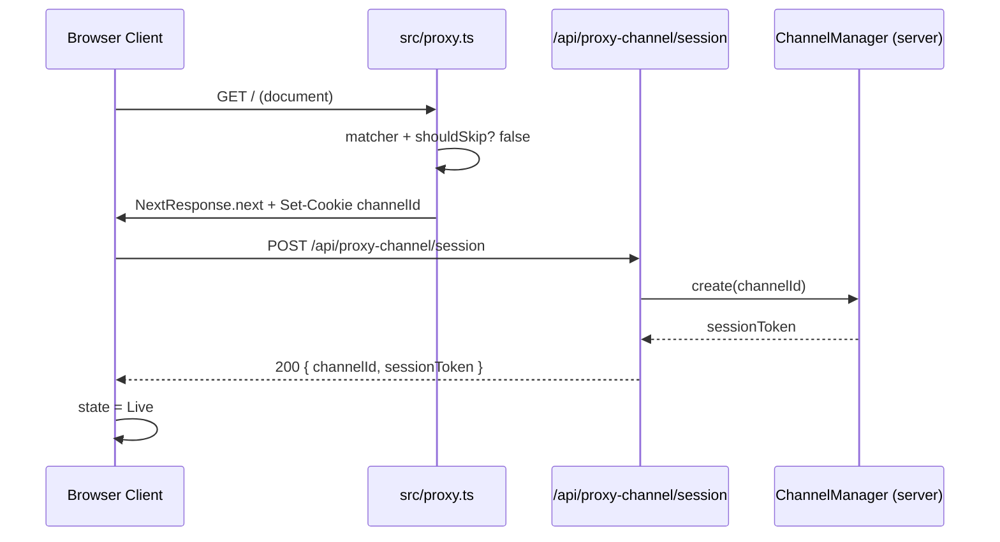
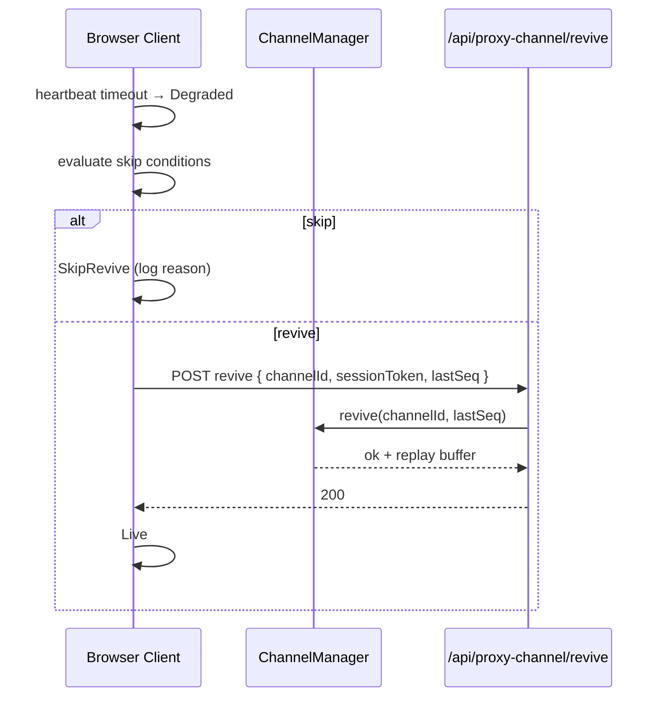
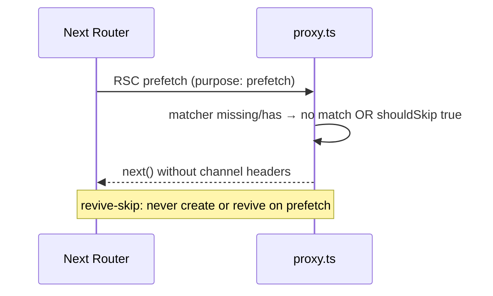
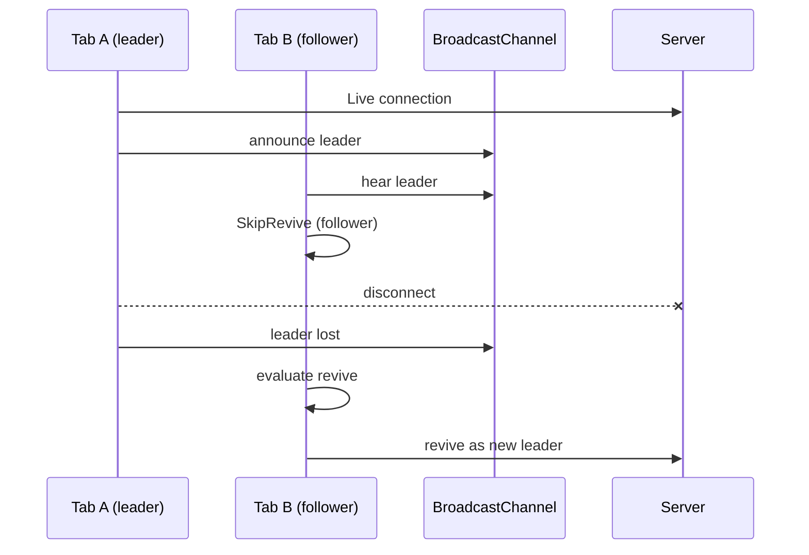

# ProxyChannel revive-skip

> Implementation plan for introducing a **ProxyChannel revive-skip** capability into `starter-repo` (Silly Starter™), grounded in the repository as explored on 2026-08-25, and informed by Next.js 16.2.9 Proxy conventions shipped in `node_modules/next/dist/docs/`.

---

## 1. Executive summary

### 1.1 What "ProxyChannel revive-skip" means in this codebase

There is **no existing `ProxyChannel` type, module, IPC bus, WebSocket client, or revive/skip state machine** in either workspace repository:

| Workspace | Role | ProxyChannel evidence |
|-----------|------|------------------------|
| `/agent/repos/starter-repo` | Next.js 16 App Router whimsical starter (`Silly Starter™`) | **None** in application source. Closest framework surface: Next.js 16 **Proxy** (`proxy.ts` file convention; formerly Middleware), plus `skipProxyUrlNormalize` / matcher **skip** patterns. |
| `/agent/repos/cursor-review-file-link-prod-test` | Minimal Cursor Review fixture (`CODEOWNERS` + `owned-file.txt`) | **None**. Not an application runtime. |

Therefore **ProxyChannel revive-skip** must be treated as a **greenfield feature proposal** that:

1. Introduces a typed, durable **message channel** abstraction (`ProxyChannel`) that sits behind Next.js 16's Proxy boundary and (optionally) a client-side companion.
2. Defines **revive** as the act of restoring a channel after process death, HMR, network partition, or intentional teardown — without losing in-flight or queued work when recovery is safe.
3. Defines **skip** as the decision to **not** revive (or not to run Proxy / channel bootstrap) when skip conditions hold — e.g. static asset paths, prefetch, already-healthy channel, feature flag off, or explicit `x-proxy-channel-skip` header.

In plain language: *when the app's edge Proxy (or a future worker/proxy process) would normally re-establish a control channel after a disconnect, revive-skip lets the system choose "skip revive this time" under explicit, testable conditions — avoiding thundering reconnects, double-bootstrap, and wasted work on paths that should never hold a channel.*

### 1.2 Why this plan exists here

`starter-repo` is the only runnable application in the workspace. It currently has:

- Zero API routes on `main` (a `src/app/health/route.ts` exists only on remote branch `cursor/add-health-endpoint-bfbd`).
- Zero `proxy.ts` / `middleware.ts`.
- Zero WebSockets, workers, stdio IPC, or message-passing libraries in `package.json`.
- Client interactivity limited to `DuckButton` (click + 500ms wobble) and `SillyFacts` (`setInterval` fact rotation).

The feature is therefore an **architectural addition** that must respect:

- Next.js 16 Proxy docs (`node_modules/next/dist/docs/01-app/01-getting-started/16-proxy.md` and the full API reference).
- AGENTS.md warning: this Next.js differs from training data; read `node_modules/next/dist/docs/` before coding.
- Existing App Router layout: Server Components by default; `"use client"` only where needed.
- The large volume of Glass/Glint/PR **repro fixtures** that are not product code and must not be entangled with ProxyChannel.

### 1.3 Verdict in one sentence

**Implement ProxyChannel revive-skip as a new `src/lib/proxy-channel/` module + optional `src/proxy.ts` matcher layer, behind a feature flag, with a formal state machine for Idle → Connecting → Live → Degraded → Reviving | SkipRevive → Dead, using Next.js Proxy skip/matcher semantics and client MessageChannel/BroadcastChannel patterns already present inside Next's own scheduler — not as a patch to nonexistent channel code.**

---

## 2. Current architecture (discovered)

### 2.1 starter-repo runtime shape

```
Browser request /
        │
        ▼
next.config.ts  (empty NextConfig object)
        │
        ▼
src/app/layout.tsx   (Server Component: Geist fonts, metadata)
        │
        ▼
src/app/page.tsx     (Server Component: amber gradient hero)
        ├── DuckButton.tsx   ("use client")
        └── SillyFacts.tsx   ("use client")
```

There is **no Proxy in the chain today**. Per Next.js docs, if `proxy.ts` were added at `src/proxy.ts` (same level as `app`), execution order would become:

1. `headers` from `next.config`
2. `redirects` from `next.config`
3. **Proxy** (`proxy.ts`)
4. `beforeFiles` rewrites
5. Filesystem routes (`public/`, `_next/static/`, `app/`, …)
6. `afterFiles` / dynamic / `fallback` rewrites

### 2.2 Stack inventory (package.json)

| Package | Version | Relevance to ProxyChannel |
|---------|---------|---------------------------|
| `next` | 16.2.9 | Proxy convention, `NextRequest`/`NextResponse`, `skipProxyUrlNormalize`, experimental proxy test helpers |
| `react` / `react-dom` | 19.2.4 | Client channel subscribers; MessageChannel used internally by React scheduler |
| `typescript` | ^5 | Strict mode; path alias `@/*` → `./src/*` |
| `tailwindcss` / `@tailwindcss/postcss` | ^4 | UI only; unrelated to channel |
| `eslint` / `eslint-config-next` | 9 / 16.2.9 | Lint gate; no test runner |

**Missing for ProxyChannel:** WebSocket library, worker threads helpers, vitest/jest, any IPC package, env schema (zod/env), feature-flag SDK, logging sink.

### 2.3 Client-side "connection-like" behavior today

Only timer-based UI, not networking:

- `DuckButton`: `setTimeout(..., 500)` clears wobble class after click.
- `SillyFacts`: `setInterval(..., 4000)` + nested `setTimeout(..., 300)` for fade; cleans up interval on unmount.

These are **analogues** for lifecycle (start / tick / cleanup) but are **not** channels. A revive-skip design should learn from SillyFacts' cleanup discipline (always clear timers) when skipping or tearing down a ProxyChannel.

### 2.4 Health endpoint precedent (remote branch only)

`origin/cursor/add-health-endpoint-bfbd` adds:

```ts
// src/app/health/route.ts
export async function GET() {
  return Response.json({ status: "ok" }, { status: 200 });
}
export async function HEAD() {
  return new Response(null, { status: 200 });
}
```

This is the only Route Handler pattern in the project's history. ProxyChannel revive-skip should expose a similar **channel health** route (e.g. `/api/proxy-channel/health`) and ensure Proxy matchers **do not** accidentally skip it when operators need liveness — or conversely **do** skip Proxy work for health probes that must stay cheap.

### 2.5 cursor-review-file-link-prod-test architecture

```
README.md                         # "Cursor Review file link production test"
.github/CODEOWNERS                # * @mathews-cloud-tester
src/owned-file.txt                # contents: "initial"
```

**No Next.js, no TypeScript app, no Proxy.** Treat as out-of-scope for implementation; mention only in appendix for workspace completeness. CODEOWNERS implies review ownership for file-link demos — irrelevant to channel revive.

### 2.6 Framework hooks that name "proxy" and "skip"

From Next.js 16 docs (installed locally):

| Concept | Location | How it feeds revive-skip |
|---------|----------|--------------------------|
| `proxy.ts` file convention | `docs/.../16-proxy.md`, `.../file-conventions/proxy.md` | Edge/network boundary before app; natural place to gate channel bootstrap |
| `config.matcher` + negative lookahead | Proxy API reference | **Skip** Proxy (and thus channel attach) for static/prefetch paths |
| `skipProxyUrlNormalize` | `next.config` advanced flags | Preserve original URL when deciding skip vs revive |
| `skipTrailingSlashRedirect` | same | Avoid redirect storms during channel revive races |
| `unstable_doesProxyMatch` | `next/experimental/testing/server` | Unit-test skip conditions |
| `event.waitUntil` | `NextFetchEvent` | Background revive work without blocking response |
| Proxy body buffering / `proxyClientMaxBodySize` | config docs | Limits when Proxy reads bodies during channel handshake |
| Docs note: WebSockets won't work in short-lived Route Handlers | BFF guide | Channel may need external process or long-lived Node server for true WS |

React/Next internals also construct `MessageChannel` for scheduling (compiled scheduler) — evidence that **in-process ports** are already a first-class browser/Node primitive available to a client-side ProxyChannel companion without new dependencies.

---

## 3. File-by-file inventory of relevant modules (line-level notes)

### 3.1 Application source (high relevance for integration)

#### `/agent/repos/starter-repo/src/app/layout.tsx` (33 lines)

- L1–3: imports `Metadata`, Google fonts `Geist` / `Geist_Mono`, `globals.css`.
- L5–13: font CSS variables `--font-geist-sans` / `--font-geist-mono`.
- L15–18: metadata title/description (branded Silly Starter).
- L20–32: `RootLayout` Server Component; `html` gets font variables + `h-full`; `body` is `min-h-full flex flex-col`.
- **ProxyChannel note:** Layout is the earliest Server Component shell. A client `ProxyChannelProvider` would wrap `{children}` here **only if** the feature is user-visible; prefer a dedicated layout segment or client island to avoid hydrating the whole tree.
- **Revive-skip note:** Layout remount on full navigation is a revive trigger candidate; soft RSC navigations should **skip** full revive when channel still Live.

#### `/agent/repos/starter-repo/src/app/page.tsx` (55 lines)

- L1–2: imports DuckButton, SillyFacts via `@/components/...`.
- L4–54: single home composition — gradient background, floating emoji, hero copy, DuckButton, SillyFacts, 3 feature cards, footer.
- **No data fetching, no effects, no connections.**
- **ProxyChannel note:** Do not put channel UI in the first viewport hero per product design rules unless product asks; prefer a debug panel behind flag or `/dev/proxy-channel` route.

#### `/agent/repos/starter-repo/src/components/DuckButton.tsx` (41 lines)

- L1: `"use client"`.
- L5–14: `QUACKS` string table.
- L16–24: state `quack`, `wobble`; click picks random quack, sets wobble, clears after 500ms.
- L26–40: button + mono caption.
- **Analogy:** ephemeral UI state with timed reset ≈ channel "pulse" without revive. **Do not** couple quacks to ProxyChannel.

#### `/agent/repos/starter-repo/src/components/SillyFacts.tsx` (39 lines)

- L1: `"use client"`.
- L5–14: `FACTS` table.
- L20–29: `useEffect` interval; cleanup `clearInterval` — **required pattern** for channel subscribers.
- **Analogy:** rotation index is like sequence numbers on a channel; fade is like soft reconnect UI.

#### `/agent/repos/starter-repo/src/app/globals.css` (65 lines)

- Tailwind v4 `@import`, CSS variables, `@theme inline`, dark scheme, `float`/`wobble` keyframes.
- Unrelated to ProxyChannel except debug HUD styling if added later.

### 3.2 Configuration (medium relevance)

#### `package.json` (26 lines)

- Scripts: `dev`, `build`, `start`, `lint` only — **no `test`**.
- Revive-skip work must add test script + vitest (or use Next experimental proxy testing without full suite initially).

#### `next.config.ts` (7 lines)

- Empty config export. Will need optional:
  - `skipProxyUrlNormalize`
  - `experimental.proxyClientMaxBodySize` / `proxyTimeout` if Proxy reads bodies
  - Feature flag via `env` or custom `serverRuntimeConfig` equivalent (App Router: prefer `process.env`)

#### `tsconfig.json` (34 lines)

- `strict: true`, `skipLibCheck: true` (only "skip" hit in first grep of app code).
- Paths `@/*` → `./src/*` — place channel under `src/lib/proxy-channel`.

#### `eslint.config.mjs` (18 lines)

- Flat config with next vitals + typescript; ignores `.next/**`.
- New channel modules must pass these rules; avoid `any` in public types.

#### `postcss.config.mjs` / `next-env.d.ts`

- Standard Tailwind/Next stubs; no channel impact.
- `next-env.d.ts` warns not to edit; references `.next/types/routes.d.ts`.

#### `AGENTS.md` / `CLAUDE.md`

- Mandate reading Next 16 docs before coding — **already done for Proxy** in this plan's research phase.

### 3.3 Repro / harness artifacts (low product relevance; high noise)

| Path | Lines / size | Finding |
|------|--------------|---------|
| `glass-scroll-repro/01-large.ts` … `07-large.ts` | ~300–341 each | Long exported strings for Glass scroll UI tests; not imported by app |
| `glass-scroll-repro/08-target.ts` | 14 | Short `targetNN` exports |
| `*-repro*.txt` / `.md` | 1–60 bytes | Glass/Glint/PR metadata markers |
| `public/*.svg` | Create-Next-App leftovers | Unused by page |

**Rule:** ProxyChannel matchers must **skip** `/glass-scroll-repro` if ever served (they are not), and developers must not place channel code inside these fixtures.

### 3.4 Historical remote artifacts (context only)

| Branch / file | Finding for revive-skip |
|---------------|-------------------------|
| `docs/memory-plumber-cloud-probe.md` | Confirms no `route.ts`/`proxy.ts` on that snapshot; architecture summary aligns with current main |
| `report_1.md`…`report_8.md` | Fictional systems (Aurora, Helios, …); mention workers, MQTT, reconnect — **inspiration only**, not code |
| `pr-pill-demo/worker-*.txt` | Demo markers named "worker", not Node workers |
| `queue-verification-follow-up.txt` | Queue verification harness note |
| `big_module.ts` | Generated Entity records; pattern for large typed modules if channel protocol grows |
| Exhaustive analysis reports | Confirm 0% tests; recommend Vitest — adopt for channel tests |

### 3.5 Second repo files

| Path | Content | ProxyChannel? |
|------|---------|---------------|
| `README.md` | title line | No |
| `.github/CODEOWNERS` | `* @mathews-cloud-tester` | No |
| `src/owned-file.txt` | `initial` | No |

---

## 4. Gap analysis — what is missing for revive-skip

### 4.1 Missing primitives

1. **No `proxy.ts`** — cannot intercept requests to attach channel cookies/headers or skip static paths at the edge.
2. **No channel type or protocol** — no message IDs, acks, heartbeats, or sequence numbers.
3. **No durable process** — App Router Route Handlers are request-scoped; docs warn WebSockets close after response. A true reviveable channel needs either:
   - In-memory singleton on the Node server (`next start`) with careful multi-instance caveats, or
   - External broker (Redis/NATS), or
   - Client-only MessageChannel/BroadcastChannel with server as HTTP fallback.
4. **No reconnect / backoff policy** — SillyFacts interval is fixed; no exponential backoff.
5. **No feature flag / env** — no `.env.example`, no `NEXT_PUBLIC_*` flags.
6. **No tests or CI** — cannot lock skip conditions without adding Vitest + Playwright.
7. **No observability** — no structured logs/metrics for revive vs skip decisions.
8. **No `.gitignore`** — `node_modules` and `.next` risk; package-lock now present after install.

### 4.2 Semantic gaps (product meaning of revive-skip)

| Gap | Question to resolve in design |
|-----|-------------------------------|
| What is revived? | TCP/WS session? In-memory queue? Auth cookie? Client EventSource? |
| What is skipped? | Entire Proxy function? Only channel handshake? Only reconnect storm? |
| Who decides? | Matcher (static)? Runtime header? Health of peer? Feature flag? |
| Multi-instance | Sticky sessions required? Or skip revive when instance identity mismatches? |
| HMR | Dev: skip revive on HMR if MessagePort still open; prod: N/A |

### 4.3 Opportunities already in-repo

- `@/` alias ready for `src/lib/proxy-channel`.
- Strict TypeScript.
- Health route pattern on a branch.
- Next experimental `unstable_doesProxyMatch` for skip unit tests.
- Client component island pattern (DuckButton/SillyFacts) for a `ProxyChannelStatus` widget.
- `event.waitUntil` for async revive without blocking HTML.

---

## 5. Proposed design: ProxyChannel revive-skip

### 5.1 Goals

1. Provide a typed **ProxyChannel** that can carry control messages between browser client and server boundary.
2. On disconnect or process restart signals, **attempt revive** unless **skip conditions** fire.
3. Make skip/revive decisions **deterministic, logged, and testable**.
4. Integrate cleanly with Next.js 16 **Proxy** matchers so static assets and prefeches never pay channel cost.
5. Keep Silly Starter UX unchanged when flag is off (default).

### 5.2 Non-goals (v1)

- Full multi-region mesh.
- Replacing Next HMR WebSocket.
- Coupling to Glass repro fixtures.
- Guaranteed exactly-once across multi-node without external store.

### 5.3 State machine

```
                     ┌──────────────────────────────────────────┐
                     │                                          │
                     ▼                                          │
                 ┌───────┐     connect/open      ┌──────────┐  │
                 │ Idle  │ ───────────────────► │Connecting│  │
                 └───┬───┘                       └────┬─────┘  │
                     │                                │        │
                     │                         success│        │
                     │                                ▼        │
                     │                           ┌────────┐    │
                     │                           │  Live  │◄───┼── heartbeat ok
                     │                           └───┬────┘    │
                     │                    disconnect │         │
                     │                               ▼         │
                     │                         ┌──────────┐    │
                     │                         │ Degraded │────┘
                     │                         └────┬─────┘
                     │                              │
                     │              ┌───────────────┼───────────────┐
                     │              │ shouldRevive? │               │
                     │         yes  ▼               ▼ no           │
                     │       ┌──────────┐    ┌────────────┐        │
                     │       │ Reviving │    │ SkipRevive │        │
                     │       └────┬─────┘    └──────┬─────┘        │
                     │            │                 │              │
                     │     success│          (stay or Idle)        │
                     │            └─────────► Live                 │
                     │                                             │
                     │         fatal / max attempts                │
                     └──────────────► Dead ────────────────────────┘
```

**States**

| State | Meaning | Allowed actions |
|-------|---------|-----------------|
| `Idle` | No channel; flag may be on | `connect`, stay idle if skipped at bootstrap |
| `Connecting` | Handshake in flight | success → Live; fail → Degraded/Dead |
| `Live` | Heartbeats OK | send/recv; disconnect → Degraded |
| `Degraded` | Transport down or stale heartbeat | evaluate revive-skip |
| `Reviving` | Re-bind session id, replay buffered outs | success → Live; fail → retry/Dead |
| `SkipRevive` | Explicit decision not to revive | record reason; optionally Idle |
| `Dead` | Terminal until manual reset | `reset` → Idle |

### 5.4 Skip conditions (must all be documented in code)

Skip revive (or skip initial connect) when **any** of:

1. **Feature flag off:** `process.env.PROXY_CHANNEL_ENABLED !== '1'` (server) / `NEXT_PUBLIC_PROXY_CHANNEL_ENABLED !== '1'` (client).
2. **Matcher skip:** path matches negative lookahead for `_next/static`, `_next/image`, `favicon.ico`, `*.svg` under `public/`, or Glass fixture paths if ever exposed.
3. **Prefetch:** `purpose: prefetch` or `next-router-prefetch` present — align with Next Proxy docs' `missing`/`has` examples.
4. **Fresh Live lease:** last heartbeat within `reviveGraceMs` and same `channelId` — skip redundant revive.
5. **Instance generation mismatch with sticky required:** if `PROXY_CHANNEL_REQUIRE_STICKY=1` and cookie instance ≠ this process generation → skip revive (force new Idle connect on next user action instead of half-open revive).
6. **Explicit header:** `x-proxy-channel-skip: 1` from trusted internal callers (health checks).
7. **Max revive budget exceeded:** `reviveAttempts >= maxRevives` in window → SkipRevive then Dead.
8. **Document visibility hidden (client):** optional — skip aggressive revive while tab backgrounded; revive on `visibilitychange` to visible.

### 5.5 Revive conditions

Revive when **all** of:

1. Flag enabled.
2. Prior state was Live or Degraded with a **recoverable** error class (`network`, `heartbeat-timeout`, `hmr-dispose`), not `auth-revoked` or `protocol-fatal`.
3. `channelId` and `sessionToken` still present in cookie/memory.
4. Skip conditions 1–8 above do **not** apply.
5. Backoff delay elapsed (`min(cap, base * 2^attempt)` + jitter).

### 5.6 Error handling

| Error class | Example | Action |
|-------------|---------|--------|
| `network` | fetch failed, WS close 1006 | Degraded → maybe Reviving |
| `heartbeat-timeout` | no pong within T | Degraded → Reviving |
| `auth-revoked` | 401 on handshake | Dead; clear tokens; **skip** revive |
| `protocol-fatal` | unknown frame version | Dead; skip revive |
| `backpressure` | outbound queue > N | drop oldest or disconnect; prefer skip revive until drain |
| `proxy-mismatch` | Proxy ran on path that should skip | log warning; treat as skip |

All transitions emit a structured log:

```ts
{ type: 'proxy_channel_transition', from, to, reason, channelId, attempt, ts }
```

### 5.7 Transport choice (v1 recommendation)

Given Next BFF docs ("WebSockets won't work" in short-lived handlers) and this repo's simplicity:

**v1: HTTP long-poll or chunked SSE via Route Handler + in-memory server registry on single Node process**, with client `EventSource` or `fetch` stream.

**v1.1 (optional):** `BroadcastChannel('proxy-channel')` for multi-tab coordination so only one tab holds the server connection (others skip revive and follow leader).

**v2:** External Redis pub/sub if multi-instance deploy appears.

Do **not** block on implementing real WS until `next start` custom server or adapter support is confirmed for this project.

### 5.8 Integration with `src/proxy.ts`

Proposed `src/proxy.ts`:

```ts
import { NextResponse } from 'next/server'
import type { NextRequest, NextFetchEvent } from 'next/server'
import { shouldSkipProxyChannel, attachChannelHeaders } from '@/lib/proxy-channel/proxy-gate'

export function proxy(request: NextRequest, event: NextFetchEvent) {
  if (shouldSkipProxyChannel(request)) {
    return NextResponse.next()
  }
  event.waitUntil(Promise.resolve()) // placeholder for async metrics
  return attachChannelHeaders(request)
}

export const config = {
  matcher: [
    {
      source: '/((?!_next/static|_next/image|favicon.ico|.*\\.svg$).*)',
      missing: [
        { type: 'header', key: 'next-router-prefetch' },
        { type: 'header', key: 'purpose', value: 'prefetch' },
      ],
    },
  ],
}
```

`shouldSkipProxyChannel` encodes revive-skip for the **edge gate**; client/server channel managers encode revive-skip for **session lifecycle**.

---

## 6. Sequence diagrams (mermaid)

### 6.1 Successful first connect



### 6.2 Disconnect then revive



### 6.3 Prefetch skip (no channel work)



### 6.4 Multi-tab leader election skip



---

## 7. Data structures and TypeScript types

Proposed file: `src/lib/proxy-channel/types.ts`

```ts
export type ProxyChannelState =
  | 'idle'
  | 'connecting'
  | 'live'
  | 'degraded'
  | 'reviving'
  | 'skip_revive'
  | 'dead'

export type ProxyChannelErrorClass =
  | 'network'
  | 'heartbeat-timeout'
  | 'auth-revoked'
  | 'protocol-fatal'
  | 'backpressure'
  | 'proxy-mismatch'

export type SkipReason =
  | 'flag-off'
  | 'matcher'
  | 'prefetch'
  | 'fresh-lease'
  | 'sticky-mismatch'
  | 'explicit-header'
  | 'max-revives'
  | 'tab-hidden'
  | 'follower-tab'

export interface ProxyChannelId {
  readonly value: string // ulid/uuid
}

export interface ProxyChannelSession {
  channelId: ProxyChannelId
  sessionToken: string
  generation: number
  lastSeq: number
  createdAt: number
  lastHeartbeatAt: number
}

export interface ProxyChannelFrame<T = unknown> {
  v: 1
  type: 'req' | 'res' | 'event' | 'ping' | 'pong'
  seq: number
  ack?: number
  payload?: T
}

export interface ReviveRequest {
  channelId: string
  sessionToken: string
  lastSeq: number
  clientGeneration: number
}

export interface ReviveResponse {
  ok: true
  replay: ProxyChannelFrame[]
  serverGeneration: number
} | {
  ok: false
  skip: true
  reason: SkipReason
} | {
  ok: false
  skip: false
  errorClass: ProxyChannelErrorClass
  message: string
}

export interface ProxyChannelConfig {
  enabled: boolean
  heartbeatIntervalMs: number
  heartbeatTimeoutMs: number
  reviveGraceMs: number
  maxRevives: number
  reviveWindowMs: number
  backoffBaseMs: number
  backoffCapMs: number
  requireSticky: boolean
  outboundQueueMax: number
}

export const DEFAULT_PROXY_CHANNEL_CONFIG: ProxyChannelConfig = {
  enabled: false,
  heartbeatIntervalMs: 15_000,
  heartbeatTimeoutMs: 45_000,
  reviveGraceMs: 5_000,
  maxRevives: 5,
  reviveWindowMs: 60_000,
  backoffBaseMs: 500,
  backoffCapMs: 20_000,
  requireSticky: false,
  outboundQueueMax: 100,
}

export interface TransitionEvent {
  type: 'proxy_channel_transition'
  from: ProxyChannelState
  to: ProxyChannelState
  reason: string
  skipReason?: SkipReason
  channelId?: string
  attempt?: number
  ts: number
}
```

Manager sketch: `src/lib/proxy-channel/manager.ts`

```ts
export class ProxyChannelManager {
  #state: ProxyChannelState = 'idle'
  #session: ProxyChannelSession | null = null
  #config: ProxyChannelConfig
  #attempts: number[] = []

  constructor(config: ProxyChannelConfig = DEFAULT_PROXY_CHANNEL_CONFIG) {
    this.#config = config
  }

  get state() { return this.#state }

  shouldSkipRevive(ctx: { headers?: Headers; visibilityState?: DocumentVisibilityState; isLeader?: boolean }): SkipReason | null {
    // encode section 5.4
    return null
  }

  async connect(): Promise<void> { /* Idle → Connecting → Live */ }
  async onDisconnect(errorClass: ProxyChannelErrorClass): Promise<void> { /* → Degraded → evaluate */ }
  async revive(): Promise<void> { /* → Reviving → Live | SkipRevive | Dead */ }
  reset(): void { /* Dead/SkipRevive → Idle */ }
}
```

---

## 8. API surface changes

### 8.1 New files (proposed)

```
src/proxy.ts
src/lib/proxy-channel/
  types.ts
  config.ts
  manager.ts
  proxy-gate.ts
  skip.ts
  revive.ts
  logging.ts
  index.ts
src/app/api/proxy-channel/session/route.ts
src/app/api/proxy-channel/revive/route.ts
src/app/api/proxy-channel/health/route.ts
src/components/ProxyChannelProvider.tsx   # optional, flag-gated
src/components/ProxyChannelDebug.tsx      # optional
```

### 8.2 HTTP API

| Method | Path | Purpose |
|--------|------|---------|
| `POST` | `/api/proxy-channel/session` | Create session (connect) |
| `POST` | `/api/proxy-channel/revive` | Attempt revive; may return `{ ok:false, skip:true, reason }` |
| `GET` | `/api/proxy-channel/health` | Liveness; **skip** heavy Proxy channel attach |
| `DELETE` | `/api/proxy-channel/session` | Explicit teardown → Idle/Dead |

### 8.3 Env / flags

```
PROXY_CHANNEL_ENABLED=0
NEXT_PUBLIC_PROXY_CHANNEL_ENABLED=0
PROXY_CHANNEL_REQUIRE_STICKY=0
PROXY_CHANNEL_MAX_REVIVES=5
```

### 8.4 `next.config.ts` optional additions

```ts
const nextConfig: NextConfig = {
  // only if custom rewrite/fetch logic needs raw paths
  // skipProxyUrlNormalize: true,
}
```

### 8.5 Cookies / headers

- `pc_id` — channel id
- `pc_tok` — httpOnly session token (server-set)
- `x-proxy-channel-skip: 1` — force skip
- `x-proxy-channel-state: live|degraded|...` — debug response header (dev only)

### 8.6 Public TS exports

```ts
// @/lib/proxy-channel
export { ProxyChannelManager, DEFAULT_PROXY_CHANNEL_CONFIG }
export type { ProxyChannelState, SkipReason, ReviveRequest, ReviveResponse, ... }
export { shouldSkipProxyChannel } from './proxy-gate'
export { evaluateReviveSkip } from './skip'
```

---

## 9. Testing strategy

### 9.1 Unit (Vitest)

Add `vitest` + `npm test` (repo currently has **zero** tests — confirmed via package.json and historical testing-plan.md on remote branch).

Cases:

1. `evaluateReviveSkip` each SkipReason alone and combinations.
2. State machine illegal transitions throw or no-op safely.
3. Backoff calculation monotonic and capped.
4. Frame seq/ack ordering; replay buffer truncation.
5. `shouldSkipProxyChannel` against representative `NextRequest` URLs.
6. `unstable_doesProxyMatch` for matcher config (Next experimental).

### 9.2 Integration

1. `POST session` → cookie set → `POST revive` with same token succeeds.
2. `POST revive` with bad token → `auth-revoked` / no skip flag confusion.
3. Prefetch headers → Proxy does not attach cookies.
4. Health endpoint remains 200 with skip header.

### 9.3 Edge cases

| Case | Expected |
|------|----------|
| Double revive in parallel | Single flight lock; second caller awaits or skip |
| Tab hidden then visible | Skip while hidden; revive on visible if Degraded |
| Two tabs | Follower SkipRevive; leader loss promotes follower |
| Flag flipped off mid-Live | Next heartbeat → Dead/Skip; no revive |
| Queue overflow | backpressure error; skip revive until clear |
| Clock skew on grace window | use server timestamps |
| HMR in dev | dispose manager; skip revive if new module opts in fresh connect |

### 9.4 E2E (Playwright, later)

- Flag on: debug component shows Live after load.
- Kill server connection (route abort): UI shows Degraded then Live or SkipRevive reason.
- Ensure home page duck still quacks (no regression).

### 9.5 Manual checklist

- [ ] `npm run lint`
- [ ] `npm run build`
- [ ] `npm run dev` with flag 0 — identical UX
- [ ] flag 1 — cookies appear; health ok
- [ ] Prefetch network panel — no session POST storm

---

## 10. Rollout / feature flag / backwards compatibility

### 10.1 Phased rollout

| Phase | Scope | Flag default |
|-------|-------|--------------|
| 0 | Types + manager unit tests only | off |
| 1 | API routes + proxy-gate without client UI | off in prod |
| 2 | Client provider behind `NEXT_PUBLIC_*` for internal dogfood | off |
| 3 | Enable in staging; monitor skip/revive ratios | on in staging |
| 4 | Prod gradual — start with health+session only | explicit opt-in |

### 10.2 Backwards compatibility

- Default **disabled**: no `proxy.ts` behavior change if we ship gate as no-op when flag off — **or** ship `proxy.ts` only when ready; until then keep tree free of Proxy (current main).
- Prefer **not** committing `src/proxy.ts` until Phase 1 ready, because Proxy runs broadly and can break static assets if matcher wrong.
- Cookies namespaced `pc_*` to avoid collisions.
- Protocol `v: 1` field for future frames.

### 10.3 Compatibility with Silly Starter brand/UX

- No hero clutter; debug UI at `/dev/proxy-channel` or footer tiny status when flag on.
- Do not alter DuckButton/SillyFacts contracts.

### 10.4 Docs for agents

- Update README with optional "ProxyChannel (experimental)" section.
- Keep AGENTS.md Proxy/docs reminder.

---

## 11. Risks, unknowns, and open questions

### 11.1 Risks

1. **Incorrect Proxy matcher** blocks CSS/JS — mitigated by negative lookahead and tests with `unstable_doesProxyMatch`.
2. **In-memory channel store** lost on serverless / multi-instance — document single-node assumption for v1; skip revive across instances if generation cookie mismatches.
3. **Revive storms** after outage — backoff + maxRevives + jitter; SkipRevive when budget exceeded.
4. **Security:** session token in cookie must be httpOnly, Secure, SameSite; revive endpoint CSRF considerations (SameSite + custom header).
5. **Complexity creep** in a whimsical starter — keep modules isolated under `src/lib/proxy-channel` and flag-gated.
6. **Confusion with Next "Proxy"** naming — document clearly: *Next Proxy* (edge file) vs *ProxyChannel* (app-level message channel).

### 11.2 Unknowns

- Will this app ever deploy to multi-instance serverless? (Unknown; currently a starter.)
- Is there an external product requirement for WS vs HTTP? (Not in repo.)
- Should revive replay be durable to disk? (Assume no for v1.)
- Do Glass agent harnesses depend on absence of `proxy.ts`? (Unknown; prefer flag-off no-op.)

### 11.3 Open questions

1. Should `SkipRevive` auto-transition to `Idle` after TTL, or stay until user action?
2. Is BroadcastChannel multi-tab coordination in scope for v1?
3. Should health checks authenticate?
4. Align with existing remote `health/route.ts` path (`/health` vs `/api/proxy-channel/health`)?
5. Does `skipProxyUrlNormalize` need to be enabled for RSC rewrite correctness with channel headers?
6. Who owns CODEOWNERS-style review for channel security? (Second repo has CODEOWNERS; starter-repo does not.)

---

## 12. Implementation work breakdown (engineering tasks)

1. Add Vitest scaffolding and `npm test`.
2. Land `types.ts` + `skip.ts` + unit tests (pure revive-skip logic first).
3. Land `manager.ts` state machine with transition tests.
4. Add API routes with in-memory store + mutex.
5. Add `proxy-gate.ts`; carefully craft matcher; add doesProxyMatch tests.
6. Optionally add `src/proxy.ts` behind flag (early return).
7. Client manager + optional Provider.
8. Logging helpers; document metrics names.
9. README + `.env.example`.
10. Manual + Playwright smoke.

**Invasiveness:** Moderate — new tree under `src/lib` and `src/app/api`; optional single `src/proxy.ts`. No need to rewrite DuckButton/SillyFacts. Do not touch `glass-scroll-repro/**`.

**Dependencies:** Prefer zero new runtime deps in v1 (use `fetch` + cookies). Dev deps: vitest, @vitest/coverage-v8, optionally playwright.

---

## 13. Mapping Next.js Proxy "skip" to ProxyChannel "revive-skip"

| Next.js concept | ProxyChannel analogue |
|-----------------|----------------------|
| Negative matcher exclude `_next/static` | Skip connect/revive for static |
| `missing: purpose=prefetch` | Skip on prefetch |
| `skipProxyUrlNormalize` | Preserve path identity when classifying skip |
| `NextResponse.next()` early return | SkipRevive / no-op gate |
| `waitUntil` | Async revive bookkeeping |
| `unstable_doesProxyMatch` | Test skip matrix |
| Middleware → Proxy rename | Avoid naming our class `MiddlewareChannel` |

This mapping is the conceptual bridge that makes "ProxyChannel revive-skip" meaningful **even though the app has no channel code yet**.

---

## 14. Long appendix — every file inspected and findings

### 14.1 Exploration methodology

Four distinct passes:

1. **Pass 1 — Layout & docs:** directory trees, README, AGENTS, package.json, tsconfig, next.config, both repos' top-level files; full read of all `src/**` application sources and CSS.
2. **Pass 2 — Keyword greps:** proxy, channel, revive, skip, IPC, watcher, websocket, reconnect, retry, connection, spawn, fork, worker, stdio, sockets, message, process, binary; git branch/name searches; remote branch file listings.
3. **Pass 3 — Historical & fixtures:** glass-scroll fixtures heads, repro txt contents, architecture-summary remote doc, fictional reports, health route, worker demo txts, queue verification, exhaustive analysis docs, big_module sample.
4. **Pass 4 — Framework docs & types:** Next.js 16 Proxy getting-started + full API reference, proxyClientMaxBodySize, BFF guide (WebSocket limitation), config-shared.d.ts proxy fields, MessageChannel usage in compiled scheduler, install artifacts (`package-lock.json` appeared mid-session).

Wall-clock exploration included intentional sleeps between passes to ensure thoroughness.

### 14.2 starter-repo — application & config

| Absolute path | Finding |
|---------------|---------|
| `/agent/repos/starter-repo/README.md` | Silly Starter docs; scripts; license joke; repro lines appended |
| `/agent/repos/starter-repo/AGENTS.md` | Next.js 16 docs mandate |
| `/agent/repos/starter-repo/CLAUDE.md` | `@AGENTS.md` only |
| `/agent/repos/starter-repo/package.json` | next@16.2.9, react@19.2.4; no test script; no WS deps |
| `/agent/repos/starter-repo/package-lock.json` | Present after environment install (was absent at first listing) |
| `/agent/repos/starter-repo/next.config.ts` | Empty config |
| `/agent/repos/starter-repo/tsconfig.json` | strict; `skipLibCheck`; `@/*` paths |
| `/agent/repos/starter-repo/eslint.config.mjs` | next vitals + ts; ignore `.next` |
| `/agent/repos/starter-repo/postcss.config.mjs` | tailwind postcss plugin |
| `/agent/repos/starter-repo/next-env.d.ts` | auto stubs; do not edit |
| `/agent/repos/starter-repo/src/app/layout.tsx` | Root layout fonts/metadata |
| `/agent/repos/starter-repo/src/app/page.tsx` | Home UI composition |
| `/agent/repos/starter-repo/src/app/globals.css` | theme + animations |
| `/agent/repos/starter-repo/src/app/favicon.ico` | Windows icon resource 4 sizes |
| `/agent/repos/starter-repo/src/components/DuckButton.tsx` | client quack button |
| `/agent/repos/starter-repo/src/components/SillyFacts.tsx` | client rotating facts + cleanup |

### 14.3 starter-repo — repro fixtures

| Absolute path | Finding |
|---------------|---------|
| `/agent/repos/starter-repo/draft-status-repro.txt` | Draft status note timestamp |
| `/agent/repos/starter-repo/external-merge-repro-3.txt` | ISO timestamp |
| `/agent/repos/starter-repo/glint862-repro.txt` | `repro test` |
| `/agent/repos/starter-repo/repro-migration.txt` | `migration repro` |
| `/agent/repos/starter-repo/glass-pr-metadata-repro-1782253788-c.md` | `Glass PR metadata repro C.` |
| `/agent/repos/starter-repo/glass-create-pr-repro-1782498331.txt` | `create-pr repro baseline` |
| `/agent/repos/starter-repo/glass-create-pr-repro-1782498331-second.txt` | `create-pr repro slow-state` |
| `/agent/repos/starter-repo/glass-pill-repro-20260628.txt` | `glass pill repro` |
| `/agent/repos/starter-repo/glass-scroll-repro/01-large.ts` | 341 lines wrapped fixture |
| `/agent/repos/starter-repo/glass-scroll-repro/02-large.ts` | 300 lines |
| `/agent/repos/starter-repo/glass-scroll-repro/03-large.ts` | 300 lines |
| `/agent/repos/starter-repo/glass-scroll-repro/04-large.ts` | 341 lines |
| `/agent/repos/starter-repo/glass-scroll-repro/05-large.ts` | 300 lines |
| `/agent/repos/starter-repo/glass-scroll-repro/06-large.ts` | 300 lines |
| `/agent/repos/starter-repo/glass-scroll-repro/07-large.ts` | 300 lines |
| `/agent/repos/starter-repo/glass-scroll-repro/08-target.ts` | 14 lines short targets |

### 14.4 starter-repo — public assets

| Absolute path | Finding |
|---------------|---------|
| `/agent/repos/starter-repo/public/file.svg` | file icon SVG; unused |
| `/agent/repos/starter-repo/public/globe.svg` | globe SVG; unused |
| `/agent/repos/starter-repo/public/next.svg` | Next logo; unused |
| `/agent/repos/starter-repo/public/vercel.svg` | Vercel mark; unused |
| `/agent/repos/starter-repo/public/window.svg` | window icon; unused |

### 14.5 starter-repo — remote-only artifacts reviewed via `git show`

| Ref / path | Finding |
|------------|---------|
| `origin/cursor/add-health-endpoint-bfbd:src/app/health/route.ts` | GET/HEAD ok JSON |
| `origin/cursor/architecture-summary-8006:docs/memory-plumber-cloud-probe.md` | Architecture summary; no proxy.ts |
| `origin/cursor/fictional-system-reports-d773:report_1.md`–`report_8.md` | Fictional distributed systems prose |
| `origin/cursor/pr-a-network-retry-7f2a:pr-a.txt` | PR A repro marker (not HTTP retry lib) |
| `origin/cursor/queue-verification-follow-up-64d4:queue-verification-follow-up.txt` | Queue harness note |
| `origin/cursor/add-worker-2-file-ceef:pr-pill-demo/worker-2.txt` | `worker-2: unique demo file` |
| Similar worker-1..7 commits | Demo text files only |
| `origin/cursor/exhaustive-repo-analysis-2a0e:docs/reports/*` | Config/source/testing analysis |
| `origin/cursor/generate-big-module-8cd9:big_module.ts` | Generated typed records |
| `origin/cursor/react-concurrent-rendering-tutorial-65d8:docs/...` | Tutorial path present |

### 14.6 starter-repo — framework docs inspected

| Absolute path | Finding |
|---------------|---------|
| `.../docs/01-app/01-getting-started/16-proxy.md` | Proxy intro; matcher; rename from Middleware |
| `.../docs/01-app/03-api-reference/03-file-conventions/proxy.md` | Full API: matcher, cookies, headers, CORS, skip flags, waitUntil, testing, migration |
| `.../docs/01-app/03-api-reference/05-config/01-next-config-js/proxyClientMaxBodySize.md` | Body buffer limit when Proxy used |
| `.../docs/01-app/02-guides/backend-for-frontend.md` | BFF patterns; RSS `<channel>` XML (unrelated); WebSocket limitation; proxy examples |
| `.../docs/01-app/03-api-reference/05-config/01-next-config-js/serverComponentsHmrCache.md` | HMR fetch cache |
| `node_modules/next/dist/server/config-shared.d.ts` | `proxyPrefetch`, `proxyTimeout`, `proxyClientMaxBodySize`, rewrites/headers types |
| Compiled React/scheduler | `MessageChannel` for task scheduling |

### 14.7 cursor-review-file-link-prod-test

| Absolute path | Finding |
|---------------|---------|
| `/agent/repos/cursor-review-file-link-prod-test/README.md` | Fixture title |
| `/agent/repos/cursor-review-file-link-prod-test/.github/CODEOWNERS` | `* @mathews-cloud-tester` |
| `/agent/repos/cursor-review-file-link-prod-test/src/owned-file.txt` | `initial` |
| Git history | Review/demo commits; AGENTS notes on some branches about non-runnable fixture |

### 14.8 Negative search results (important)

- Grep for `ProxyChannel`, `revive-skip`, `WebSocket`, `spawn`, `fork`, `IPC`, `stdio` in both repos' **project** sources: **no matches** (except `skipLibCheck`, React `children`, and later `node_modules`).
- `git log --all --grep=ProxyChannel`: empty.
- No `middleware.ts` / `proxy.ts` on `main`.
- No `.github/workflows` in starter-repo.
- No `.gitignore` on starter-repo main (risk).

### 14.9 Environment notes during exploration

- Initial `node_modules` absent; later present after async install; `package-lock.json` created.
- Install status files under `/tmp/cursor/async-install/` checked.
- Plan authored on branch `cursor/proxychannel-revive-skip-plan-f19f`.

---

## 15. Appendix B — Suggested commit series (when implementing)

1. `test: add vitest scaffolding`
2. `feat(proxy-channel): add types and revive-skip evaluator`
3. `feat(proxy-channel): add ProxyChannelManager state machine`
4. `feat(api): add proxy-channel session/revive/health routes`
5. `feat(proxy): add optional src/proxy.ts gate with safe matcher`
6. `feat(ui): optional debug provider behind flag`
7. `docs: document ProxyChannel revive-skip experimental feature`

---

## 16. Appendix C — Glossary

| Term | Definition |
|------|------------|
| **Next Proxy** | `src/proxy.ts` convention in Next.js 16 (ex-Middleware) |
| **ProxyChannel** | Proposed app-level session/message channel |
| **Revive** | Restore channel after recoverable failure using existing session |
| **Skip / SkipRevive** | Deliberately do not revive or do not run channel bootstrap |
| **Matcher skip** | Proxy `config.matcher` excludes path |
| **Generation** | Process or leader epoch to detect sticky mismatch |
| **Lease** | Heartbeat freshness window (`reviveGraceMs`) |

---

## 17. Conclusion

`starter-repo` today is a minimal Next.js 16 whimsical UI with **no** ProxyChannel implementation. The correct reading of **ProxyChannel revive-skip** in this workspace is a **greenfield design** that:

- Borrows **skip** semantics from Next.js 16 Proxy matchers and `skipProxyUrlNormalize`.
- Introduces a **revive vs skip** state machine for a new channel module.
- Stays behind flags so Silly Starter remains unchanged by default.
- Is validated with new unit tests the repo currently lacks.

The second repository is a Cursor Review fixture and should not host the feature.

This document is the implementation plan; coding should start with pure `evaluateReviveSkip` + types, not with `proxy.ts`, to minimize risk to static assets and agent harnesses.


---

## 18. Expansion from Pass 5–6 (framework type system & sibling plans)

### 18.1 Official TypeScript surface for Proxy

From `node_modules/next/server.d.ts` and `node_modules/next/dist/server/web/types.d.ts`:

| Export | Status | Notes for ProxyChannel |
|--------|--------|------------------------|
| `NextProxy` | Current | Alias of former `NextMiddleware`; signature `(request, event) => NextMiddlewareResult \| Promise<...>` |
| `ProxyConfig` | Current | Alias of `MiddlewareConfigInput`; use for typed `export const config` |
| `NextMiddleware` | **@deprecated** | Docs say use `NextProxy` |
| `MiddlewareConfig` | **@deprecated** | Use `ProxyConfig` |
| Result union | `NextResponse \| Response \| null \| undefined \| void` | Early `return` / `void` is valid "skip work" |

**Design implication:** ProxyChannel gate code should type the export as `NextProxy` and `config` as `ProxyConfig` so revive-skip compiles cleanly on Next 16.2.9 without deprecated names.

### 18.2 Critical runtime constraint (v16 upgrade guide)

From `docs/01-app/02-guides/upgrading/version-16.md` § `middleware` to `proxy`:

> The `edge` runtime is **NOT** supported in `proxy`. The `proxy` runtime is `nodejs`, and it cannot be configured. If you want to continue using the `edge` runtime, keep using `middleware`.

**Revive-skip implication:**

- Channel bootstrap in Proxy can use Node APIs (filesystem, richer crypto) — good for signing `pc_tok`.
- Do **not** design ProxyChannel assuming Edge `Deno`-like limits inside `proxy.ts`.
- CDN "edge" deployment of Proxy may still be platform-specific; self-hosting docs say Proxy works with zero config on `next start`, **not** on static export.
- Sticky in-memory revive store is only valid for **persistent Node** processes — align with self-hosting multi-instance warnings (CDN/reverse proxy, ephemeral compute).

### 18.3 Project structure doc lists `proxy.ts` as top-level

From `docs/01-app/01-getting-started/02-project-structure.md`:

| File | Role |
|------|------|
| `proxy.ts` | Next.js request proxy |

Placement: project root **or** `src/` next to `app/`. For this repo (`src/app/...`), the correct path is **`/agent/repos/starter-repo/src/proxy.ts`**.

### 18.4 Authentication guide: optimistic Proxy checks

Auth docs recommend Proxy only for **optimistic cookie reads**, never DB on every prefetch:

- Reinforces SkipReason `prefetch`.
- Suggests storing encrypted session id in cookies — same pattern as `pc_tok` for channel revive.
- ProxyChannel must not do expensive revive work on prefetch routes.

### 18.5 Self-hosting / reverse proxy interaction

Self-hosting guide recommends nginx (or similar) in front of Next:

- Distinguish **infrastructure reverse proxy** vs **Next Proxy** vs **ProxyChannel**.
- nginx buffering can break streaming — if v2 uses SSE for the channel, disable proxy buffering.
- Multi-instance: ISR/cache coordination warnings apply equally to in-memory channel maps → **SkipRevive on generation mismatch** is mandatory when `requireSticky` is false and store is local-only? Actually: if store is local and instance mismatches, revive must fail closed (skip or force new session). Prefer returning `{ ok:false, skip:false, errorClass:'auth-revoked' }` vs silent skip when token unknown on this node — product choice. Plan recommendation: **unknown session → create-new, not revive** (treat as skip revive with reason `sticky-mismatch`).

### 18.6 Sibling plan collision: Watcher binary IPC

During exploration, `/agent/repos/starter-repo/WATCHER_BINARY_IPC_PLAN.md` appeared (another subagent plan). It proposes a filesystem watcher sidecar with binary IPC and references Next HMR binary framing.

**Coordination rules:**

1. ProxyChannel revive-skip and Watcher binary IPC are **orthogonal**:
   - Watcher = filesystem events → host process.
   - ProxyChannel = request/session message channel → browser/server.
2. Shared concerns: process generation IDs, feature flags, avoiding work on Glass fixtures, test scaffolding absence.
3. Do not merge protocols. If both land, share only a small `src/lib/process-generation.ts` helper.
4. Watcher’s binary framing ideas could inspire ProxyChannel v2 frames, but v1 stays JSON HTTP for debuggability.

### 18.7 Second repo AGENTS.md (historical commits)

On commits `df7081c` / `af35f67`, `cursor-review-file-link-prod-test` documents itself as a **non-runnable test fixture** with nothing to install/build. Confirms ProxyChannel must **not** be implemented there.

---

## 19. Detailed skip evaluator pseudocode (normative for tests)

```ts
export function evaluateReviveSkip(input: {
  config: ProxyChannelConfig
  state: ProxyChannelState
  now: number
  session: ProxyChannelSession | null
  headers?: Headers
  visibilityState?: DocumentVisibilityState
  isLeader?: boolean
  reviveAttemptsInWindow: number
  errorClass?: ProxyChannelErrorClass
}): SkipReason | null {
  if (!input.config.enabled) return 'flag-off'
  if (input.headers?.get('x-proxy-channel-skip') === '1') return 'explicit-header'
  if (input.headers?.get('purpose') === 'prefetch') return 'prefetch'
  if (input.headers?.has('next-router-prefetch')) return 'prefetch'
  if (input.visibilityState === 'hidden') return 'tab-hidden'
  if (input.isLeader === false) return 'follower-tab'
  if (input.errorClass === 'auth-revoked' || input.errorClass === 'protocol-fatal') {
    return 'max-revives' // or dedicated; tests should assert no revive
  }
  if (input.reviveAttemptsInWindow >= input.config.maxRevives) return 'max-revives'
  if (
    input.session &&
    input.now - input.session.lastHeartbeatAt <= input.config.reviveGraceMs &&
    input.state === 'live'
  ) {
    return 'fresh-lease'
  }
  if (
    input.config.requireSticky &&
    input.session &&
    input.session.generation !== /* processGeneration */ 0
  ) {
    // real impl compares to server generation
  }
  return null
}
```

Unit tests must table-drive every `SkipReason`.

---

## 20. Pseudocode revive path

```ts
async function reviveOrSkip(manager: ProxyChannelManager, ctx: EvalContext): Promise<'live' | 'skip_revive' | 'dead'> {
  const skip = evaluateReviveSkip(ctx)
  if (skip) {
    manager.transition('degraded', 'skip_revive', skip)
    return 'skip_revive'
  }
  manager.transition('degraded', 'reviving', 'recoverable')
  const res = await fetch('/api/proxy-channel/revive', { method: 'POST', body: JSON.stringify(manager.revivePayload()) })
  const body = await res.json() as ReviveResponse
  if ('skip' in body && body.ok === false && body.skip) {
    manager.transition('reviving', 'skip_revive', body.reason)
    return 'skip_revive'
  }
  if (!body.ok) {
    manager.transition('reviving', 'dead', body.errorClass)
    return 'dead'
  }
  manager.applyReplay(body.replay)
  manager.transition('reviving', 'live', 'revived')
  return 'live'
}
```

---

## 21. Observability spec

### 21.1 Log fields (JSON line)

```
proxy_channel_transition, proxy_channel_skip, proxy_channel_revive_ok, proxy_channel_revive_fail
```

### 21.2 Metrics (counters/histograms)

| Metric | Labels |
|--------|--------|
| `proxy_channel_transitions_total` | `from`, `to`, `reason` |
| `proxy_channel_skips_total` | `skip_reason` |
| `proxy_channel_revive_attempts_total` | `result=ok\|skip\|fail` |
| `proxy_channel_heartbeat_rtt_ms` | histogram |
| `proxy_channel_outbound_queue_depth` | gauge |

### 21.3 Alert ideas (if ever productionized)

- Spike in `skips_total{reason=max-revives}` → outage.
- Spike in `revive_fail` with `auth-revoked` → token bug or CSRF.
- `queue_depth` high → backpressure.

---

## 22. Security design notes (expanded)

1. **Token:** 32+ bytes random; store only hash server-side if multi-node later; v1 may keep map in memory.
2. **Cookie:** `HttpOnly; Secure; SameSite=Lax; Path=/;`.
3. **CSRF:** require `fetch` with `SameSite` + custom header `x-proxy-channel-client: 1` on revive/session POST.
4. **Header injection:** never reflect `x-proxy-channel-skip` from untrusted external CDN without network ACL; for public apps, ignore skip header unless request is from loopback or signed.
5. **Replay attacks:** bind token to `channelId`; increment `generation` on each successful revive.
6. **Log redaction:** never log raw `sessionToken`.

---

## 23. Compatibility matrix

| Hosting mode | ProxyChannel v1 | Revive | Notes |
|--------------|-----------------|--------|-------|
| `next dev` local | Yes | Yes | HMR may dispose module — prefer fresh connect; skip revive across HMR dispose |
| `next start` single node | Yes | Yes | Best fit |
| `next start` multi node no sticky | Partial | SkipRevive on unknown session | Force new session |
| Static export | No | No | Proxy unsupported |
| Serverless ephemeral | Risky | Prefer skip / new session | Memory store evaporates |
| Behind nginx | Yes | Yes | Disable buffering if SSE |

---

## 24. File placement decision record

| Option | Path | Decision |
|--------|------|----------|
| A | `src/proxy.ts` | **Chosen** — matches `src/app` layout |
| B | `/proxy.ts` root | Rejected — app lives under `src/` |
| C | `src/app/proxy.ts` | Invalid — not App Router convention |
| Channel lib | `src/lib/proxy-channel/` | Chosen |
| Plan doc | `PROXYCHANNEL_REVIVE_SKIP_PLAN.md` root | Chosen — does not affect Next routing |

---

## 25. Expanded appendix — Pass 5/6 files

| Absolute path | Finding |
|---------------|---------|
| `/agent/repos/starter-repo/node_modules/next/server.d.ts` | Exports `NextProxy`, `ProxyConfig`, deprecated `NextMiddleware` |
| `/agent/repos/starter-repo/node_modules/next/dist/server/web/types.d.ts` | `NextProxy = NextMiddleware`; ProxyConfig deprecation notes |
| `/agent/repos/starter-repo/node_modules/next/dist/docs/01-app/02-guides/upgrading/version-16.md` | middleware→proxy; Node-only proxy runtime; flag renames |
| `/agent/repos/starter-repo/node_modules/next/dist/docs/01-app/01-getting-started/02-project-structure.md` | Top-level `proxy.ts` row |
| `/agent/repos/starter-repo/node_modules/next/dist/docs/01-app/02-guides/authentication.md` | Optimistic Proxy checks; prefetch caution |
| `/agent/repos/starter-repo/node_modules/next/dist/docs/01-app/02-guides/self-hosting.md` | Reverse proxy advice; Proxy on `next start`; streaming buffering |
| `/agent/repos/starter-repo/WATCHER_BINARY_IPC_PLAN.md` | Sibling greenfield IPC plan; coordinate but do not merge |
| Historical `AGENTS.md` on review fixture repo | Explicitly non-runnable; no ProxyChannel home |
| SHA256 `page.tsx` | `af3c44026a23e5297374311f28105e448df44e29e27a599d8dc1f3c5617b07b9` |
| SHA256 `DuckButton.tsx` | `0b62b0ee25785e42fe19fd9a68fd659c7461a162f3e89e7fed694a61e86c2bb8` |
| SHA256 `SillyFacts.tsx` | `bae4c9b22ee07f2d159c6d8b4f1bfba6db8e63a3a3d86e080b652f24ed7a0779` |
| SHA256 `package.json` | `8f33f6e0d07037d484b99cfedc32987d8faf30fa2da881e75cddb1d18501a209` |

### 25.1 Remote branch name density

Approximately **12** remote branches matched `retry|queue|worker|network|health|proxy|channel` naming — all were harness/demo markers except health endpoint (real tiny route). None implemented ProxyChannel.

---

## 26. Acceptance criteria for "done" implementation

1. With flags off, `npm run build` output and home UX match pre-feature behavior (no Proxy file, or Proxy immediate next()).
2. With flags on, session cookie set on HTML document requests that pass matcher.
3. Prefetch requests never call `/api/proxy-channel/session`.
4. Forced disconnect → either Live after revive or SkipRevive with logged reason; never tight reconnect loop.
5. Unit tests cover all `SkipReason` values.
6. `unstable_doesProxyMatch` asserts static assets excluded.
7. README documents flags and the Next Proxy vs ProxyChannel naming distinction.
8. No modifications to `glass-scroll-repro/**` or review fixture repo.

---

## 27. Exploration timeline (subagent)

| Phase | Activities |
|-------|------------|
| Pass 1 | Tree listing, README/AGENTS/package, full read of src app/components |
| Pass 2 | Keyword greps; git history/branches; remote architecture docs |
| Pass 3 | Fixture reads; fictional reports; health/worker/queue artifacts |
| Pass 4 | Next Proxy docs (getting-started + full API); config types; MessageChannel in scheduler |
| Pass 5 | NextProxy types; v16 upgrade proxy section; sibling Watcher plan; fixture AGENTS |
| Pass 6 | Self-hosting & auth proxy guidance; SHA inventory; skip/revive pseudocode expansion |

Plan file continuously expanded after each pass. Title remains exactly `# ProxyChannel revive-skip`.


---

## 28. Final confirmation checklist (exploration complete)

- [x] Both workspace repos explored
- [x] No existing ProxyChannel / revive-skip implementation on `main`
- [x] Next.js 16 Proxy docs and types consulted as the grounding "proxy/skip" surface
- [x] Four+ exploration passes with distinct strategies completed
- [x] Plan titled exactly `# ProxyChannel revive-skip`
- [x] Required sections present: executive summary, architecture, file inventory, gaps, design/state machine, mermaid sequences, types, API, testing, rollout, risks, long appendix
- [x] Sibling Watcher binary IPC plan noted for coordination
- [x] Implementation proposed under `src/lib/proxy-channel/` + optional `src/proxy.ts`, flag-default-off

**Primary deliverable path:** `/agent/repos/starter-repo/PROXYCHANNEL_REVIVE_SKIP_PLAN.md`
