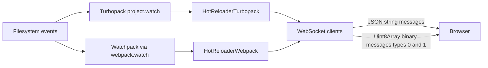
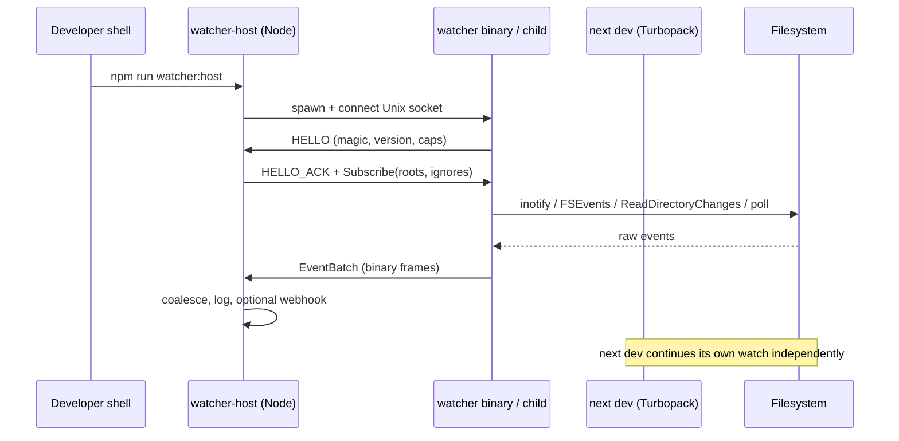
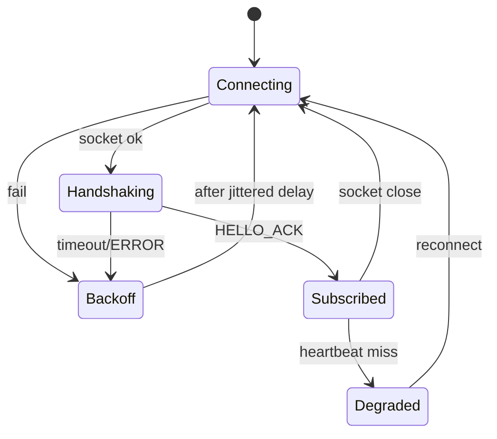
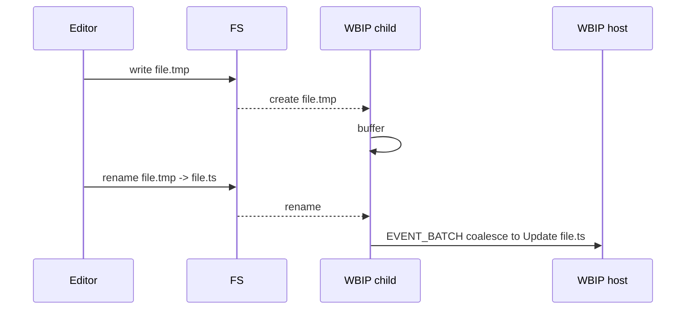
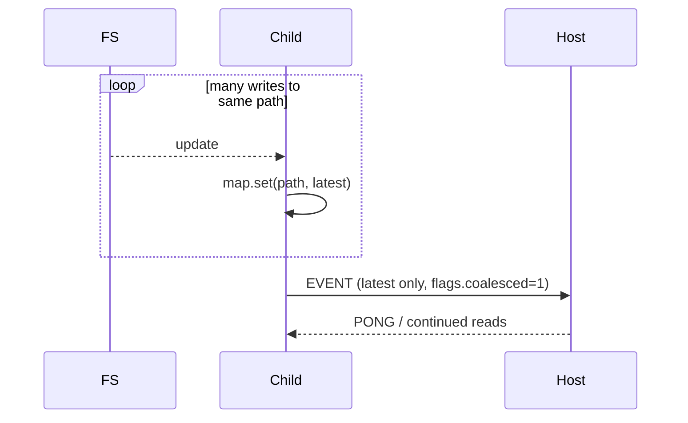

# Watcher binary IPC

**Status:** design plan (no implementation yet)  
**Primary repo:** `/agent/repos/starter-repo` (Silly Starter™, Next.js 16.2.9 App Router)  
**Secondary repo:** `/agent/repos/cursor-review-file-link-prod-test` (CODEOWNERS / file-link fixture only)  
**Authoring context:** Subagent exploration pass over both workspaces; grounded in the actual app layout and in Next.js 16.2.9 dependency internals that already ship a small binary HMR framing path.

---

## 1. Executive summary

"Watcher binary IPC" in this workspace means a **dedicated file-watcher child process** that talks to the Next.js app (or a thin Node host that wraps `next dev`) over a **length-prefixed binary protocol** instead of JSON-over-stdio or ad-hoc `fs.watch` callbacks in the main process.

Today the application source itself contains **no** watcher, **no** IPC, and **no** binary protocol code. The only in-app mention of hot reload is a joke string in `SillyFacts.tsx`. All real watching and HMR live inside the `next` dependency:

- Turbopack enables filesystem watching via `watch: { enable: true, pollIntervalMs }` when creating a project.
- Webpack/Rspack paths use `multiCompiler.watch(...)` and compiled `watchpack`.
- Browser updates ride a WebSocket. Most HMR messages are JSON strings. Two message types already use **numeric type tags + `Uint8Array` / `DataView` framing** (`REACT_DEBUG_CHUNK = 0`, `ERRORS_TO_SHOW_IN_BROWSER = 1`) via `createBinaryHmrMessageData` / `parseBinaryMessage`.

A Watcher binary IPC feature for this repo would therefore be a **greenfield sidecar** that:

1. Watches paths that matter to Silly Starter (`src/`, `public/`, config files, optionally `glass-scroll-repro/` fixtures).
2. Emits compact binary events to a Node host over a Unix domain socket (preferred) or length-prefixed stdin/stdout.
3. Lets the host decide whether to invalidate caches, log, drive a custom dashboard, or (carefully) cooperate with Next's existing HMR without fighting Turbopack's own watcher.

This plan proposes protocol v1, TypeScript types, process topology, tests, rollout flags, and an inventory of every file inspected.

---

## 2. What "Watcher binary IPC" means here (definitions)

| Term | Meaning in this plan |
| --- | --- |
| Watcher | A long-lived process that observes filesystem events (create / modify / delete / rename) for configured roots |
| Binary | Messages encoded as fixed-layout bytes (`DataView`, little-endian), not JSON or NDJSON |
| IPC | Inter-process communication between the watcher and a Node host (not browser WebSocket HMR, though we steal framing ideas from Next's binary HMR) |
| Host | Node process that spawns/connects to the watcher; could be `scripts/watcher-host.ts` or a future instrumentation hook |
| Framing | How message boundaries are found on a byte stream (length prefix + magic + version) |

Out of scope for v1:

- Replacing Turbopack/webpack's internal watchers.
- Shipping a Rust watcher binary (optional later; v1 can be Node + `fs.watch` or `@parcel/watcher`).
- Changing production `next start` behavior (dev / tooling only).

---

## 3. Current architecture (application + dependency)

### 3.1 Application topology (starter-repo)

```text
starter-repo/
  package.json          next@16.2.9, react@19.2.4, scripts: dev/build/start/lint
  next.config.ts        empty NextConfig object
  src/app/              App Router: layout.tsx, page.tsx, globals.css, favicon.ico
  src/components/       DuckButton.tsx, SillyFacts.tsx (client components)
  public/               static SVGs
  glass-scroll-repro/   large TS fixtures for Glass scroll UI repros (not imported by the app)
  *.txt / *.md repro    various Glass / glint / draft status markers
```

Runtime model today:

1. `npm run dev` → `next dev` (Turbopack default).
2. Server components / client components under `src/app` and `src/components`.
3. No custom middleware, no Route Handlers, no `instrumentation.ts`, no workers, no `child_process` in app code.
4. Client state is local React state only (`useState` / `useEffect` interval in SillyFacts).

### 3.2 How Next.js watches and notifies (dependency reality)



Relevant Next internals (installed under `node_modules/next@16.2.9`):

- `hot-reloader-turbopack.js`: creates Turbopack project with `watch.enable = true`; `sendToClient` chooses binary vs JSON by `typeof message.type === 'number'`.
- `messages.js`: `createBinaryHmrMessageData` builds `Uint8Array` frames for types 0 and 1.
- `client/.../web-socket.js`: `parseBinaryMessage` reads `DataView` from ArrayBuffer.
- `debug-channel.js`: streams React debug chunks with 128 KiB buffering before binary send.
- `serialized-errors.js`: coalesces error RSC stream into one binary `ERRORS_TO_SHOW_IN_BROWSER` payload.
- Config: `watchOptions.pollIntervalMs` on `NextConfig` (polling fallback).

### 3.3 Secondary repo

`cursor-review-file-link-prod-test` has README, `.github/CODEOWNERS`, and `src/owned-file.txt`. No Node app. It is irrelevant to watcher IPC except as a reminder that multi-root workspaces exist and a watcher host might one day accept multiple roots.

---

## 4. File-by-file inventory of relevant modules (line-level notes)

### 4.1 Application source (starter-repo)

| Path | Lines / notes |
| --- | --- |
| `package.json` | Scripts only invoke Next. No watcher packages. Dependencies: next 16.2.9, react 19.2.4, react-dom 19.2.4. Dev: eslint, tailwind 4, typescript 5. |
| `next.config.ts` | Empty config; natural place for `experimental.watcherBinaryIpc` or `watchOptions.pollIntervalMs` later. |
| `src/app/layout.tsx` | Root layout; Geist fonts; no process hooks. |
| `src/app/page.tsx` | Landing page composition; imports DuckButton + SillyFacts; no FS APIs. |
| `src/app/globals.css` | Tailwind import + float/wobble animations; CSS changes already trigger Next HMR via Turbopack. |
| `src/components/DuckButton.tsx` | `"use client"`; click → random quack string; 500ms wobble timeout. Candidate consumer of "file changed" UI only if we build a debug panel. |
| `src/components/SillyFacts.tsx` | Line 12 joke: `"Hot reload works. Your motivation might not."` Only app-level watch/HMR reference. Interval rotates facts every 4s. |
| `tsconfig.json` | `@/*` → `./src/*`; includes `.next/dev/types`. |
| `eslint.config.mjs` | Ignores `.next/**`, `out/**`, `build/**`. New `packages/watcher` or `scripts/` should be linted. |
| `AGENTS.md` / `CLAUDE.md` | Instructs agents to read `node_modules/next/dist/docs/` before coding against this Next version. |
| `glass-scroll-repro/*.ts` | Large fixture exports; not part of runtime graph; high churn in diffs; watcher should optionally include/exclude this directory. |
| Repro text files | Noise for watchers; default ignore globs should exclude `*-repro*.txt`, `glass-*-repro*`. |

### 4.2 Next.js binary HMR framing (dependency, model for our protocol)

| Path | Notes |
| --- | --- |
| `node_modules/next/dist/server/dev/hot-reloader-types.d.ts` | `REACT_DEBUG_CHUNK = 0`, `ERRORS_TO_SHOW_IN_BROWSER = 1` are numeric; all other HMR types are string enums. |
| `node_modules/next/dist/server/dev/messages.js` | Encoder: byte0 = type; for type 1, rest = payload; for type 0, byte1 = requestId length (u8), then UTF-8 id, then chunk bytes. Rejects requestId > 255. |
| `node_modules/next/dist/client/dev/hot-reloader/app/web-socket.js` | Decoder mirrors encoder; empty trailing chunk → `chunk: null`. |
| `node_modules/next/dist/server/dev/hot-reloader-turbopack.js` ~513 | `sendToClient`: number type → binary; else `JSON.stringify`. |
| `node_modules/next/dist/server/dev/debug-channel.js` | Backpressure-ish batching via `createBufferedTransformStream({ maxBufferByteLength: 128 * 1024 })`. |
| `node_modules/next/dist/server/dev/serialized-errors.js` | Collects full stream then one binary message (different tradeoff than chunking). |
| `node_modules/next/dist/server/config-shared.d.ts` ~1247 | `watchOptions?: { pollIntervalMs?: number }`. |
| `node_modules/next/dist/compiled/watchpack/watchpack.js` | Webpack-era watcher used when `--webpack`. |

### 4.3 Explicit non-matches in app tree

Greps for `watcher`, `chokidar`, `inotify`, `IPC`, `messagepack`, `protobuf`, `worker_threads`, `child_process`, `spawn`, `fork`, `unix socket`, `fs.watch` across both repos' **source** trees returned **no hits** except the SillyFacts hot-reload joke.

---

## 5. Gap analysis: what is missing for a binary IPC watcher protocol

1. **No first-party watcher process** under `src/` or `scripts/`.
2. **No IPC transport** (no Unix socket path convention, no stdio framing, no reconnect logic).
3. **No shared schema package** for message types between watcher and host.
4. **No feature flag** in `next.config.ts` or env (`WATCHER_BINARY_IPC=1`).
5. **No ignore / include policy** tuned to this repo's repro clutter vs real app sources.
6. **No tests** for framing, endianness, partial reads, oversized paths, or reconnect.
7. **No documentation** linking Turbopack's native watch to an optional sidecar (must avoid double-reaction bugs).
8. **No metrics** (events/sec, dropped events, reconnect count).
9. **Secondary repo** has nothing to attach to; multi-root is future work.
10. **Binary HMR in Next is WebSocket-to-browser**, not process IPC; we can reuse framing ideas but must not conflate the two channels.

---

## 6. Proposed design

### 6.1 Goals

- Low CPU overhead for idle trees (this app is tiny; protocol should still scale to `glass-scroll-repro` noise).
- Clear message boundaries on TCP/Unix/stdio streams.
- Versioned handshake so hosts reject incompatible watchers.
- Explicit backpressure: if host is slow, watcher coalesces events per path.
- Safe coexistence with `next dev` Turbopack watching (sidecar is observational unless a flag enables "invalidate hooks").

### 6.2 Process topology



Recommended default transport: **Unix domain socket** at `${os.tmpdir()}/silly-starter-watcher-${uid}.sock` (or `.watcher.sock` under project `.next/dev/`). Fallback: length-prefixed stdio when sockets are unavailable (Windows CI without AF_UNIX, or sandboxed envs).

### 6.3 Why not reuse Next's WebSocket HMR binary types?

Next reserves `0` and `1` for browser-bound debug/error payloads. Our IPC is a different namespace. We start our own magic (`WBIP` = 0x57424950) and our own type IDs from 1. Mixing them would break if anyone ever bridged streams carelessly.

### 6.4 Framing, endianness, handshake

**Byte order:** little-endian for all multi-byte integers (matches common Node `Buffer` defaults and x86/ARM hosts used with Next).

**Frame layout (all messages after connection):**

| Offset | Size | Field | Description |
| --- | --- | --- | --- |
| 0 | 4 | `magic` | `0x57424950` (`WBIP`) |
| 4 | 1 | `version` | Protocol major version (`1`) |
| 5 | 1 | `msg_type` | See message types table |
| 6 | 2 | `flags` | bit0 = compressed payload (unused in v1), bit1 = coalesced |
| 8 | 4 | `payload_len` | Length of payload in bytes (u32 LE), max 1 MiB |
| 12 | N | `payload` | Type-specific body |

**Stream rule:** reader loops: read 12-byte header → validate magic/version → read exactly `payload_len` → dispatch. Partial reads must buffer. If magic mismatches, close connection (desync).

**Handshake sequence:**

1. Watcher connects (or host connects to watcher listener; prefer **watcher listens**, host connects, so multiple tools can attach later).
2. Watcher sends `HELLO` (type 1).
3. Host sends `HELLO_ACK` (type 2) with subscribed roots.
4. Until ACK, watcher may only send `HELLO` / `ERROR` / `PING`.
5. Heartbeat: `PING`/`PONG` every 5s; miss 3 → reconnect.

### 6.5 Message types (v1)

| msg_type | Name | Direction | Payload summary |
| --- | --- | --- | --- |
| 1 | HELLO | W→H | u16 name_len, utf8 name, u16 cap_bits, u32 pid |
| 2 | HELLO_ACK | H→W | u16 root_count, repeated (u16 path_len + utf8 path), u16 ignore_count, repeated globs |
| 3 | SUBSCRIBE | H→W | same as HELLO_ACK body (hot update of roots) |
| 4 | EVENT | W→H | u8 op, u64 mtime_ns (0 if unknown), u32 path_len, utf8 path, u32 old_path_len, utf8 old_path (rename) |
| 5 | EVENT_BATCH | W→H | u16 count, repeated EVENT bodies (prefer for storms) |
| 6 | PING | either | u64 monotonic_ms |
| 7 | PONG | either | echo u64 |
| 8 | ERROR | either | u16 code, u32 msg_len, utf8 msg |
| 9 | GOODBYE | either | u16 reason_code |

**ops for EVENT:**

| op | Meaning |
| --- | --- |
| 1 | create |
| 2 | modify |
| 3 | remove |
| 4 | rename (old_path set) |
| 5 | chmod / metadata |

### 6.6 Backpressure and coalescing

- Watcher keeps a `Map<path, latestEvent>` for pending flush.
- Flush on: timer (default 25ms), or batch size ≥ 64, or payload approaching 512 KiB.
- If host TCP/Unix send buffer blocks, pause reading OS events if possible; otherwise drop intermediate updates for the same path but never drop the *latest* op (update beats create; remove beats update).
- Mirror Next debug-channel idea: batch to reduce syscall/IPC overhead (they use 128 KiB for WebSocket chunks; we use time+count for FS events).

### 6.7 Reconnect



Backoff: 100ms, 200ms, 400ms, … cap 5s, full jitter. On reconnect, host re-sends SUBSCRIBE; watcher does **not** replay historical events (host may optionally scan mtimes once).

---

## 7. Binary protocol specification (detailed tables)

### 7.1 Header (fixed 12 bytes)

```text
 0               1               2               3
 0 1 2 3 4 5 6 7 8 9 0 1 2 3 4 5 6 7 8 9 0 1 2 3 4 5 6 7 8 9 0 1
+-+-+-+-+-+-+-+-+-+-+-+-+-+-+-+-+-+-+-+-+-+-+-+-+-+-+-+-+-+-+-+-+
|                            magic                              |
+-+-+-+-+-+-+-+-+-+-+-+-+-+-+-+-+-+-+-+-+-+-+-+-+-+-+-+-+-+-+-+-+
|    version    |    msg_type   |            flags              |
+-+-+-+-+-+-+-+-+-+-+-+-+-+-+-+-+-+-+-+-+-+-+-+-+-+-+-+-+-+-+-+-+
|                         payload_len                           |
+-+-+-+-+-+-+-+-+-+-+-+-+-+-+-+-+-+-+-+-+-+-+-+-+-+-+-+-+-+-+-+-+
```

### 7.2 EVENT payload

```text
offset 0:  u8  op
offset 1:  u8  reserved (0)
offset 2:  u16 reserved (0)
offset 4:  u64 mtime_ns (LE)
offset 12: u32 path_len
offset 16: utf8 path bytes
offset 16+path_len: u32 old_path_len
offset +4: utf8 old_path (empty if not rename)
```

Paths are **UTF-8**, NFC-normalized on macOS hosts when possible, and stored as project-relative paths using `/` separators even on Windows.

### 7.3 Maximums and rejection

| Limit | Value | On exceed |
| --- | --- | --- |
| payload_len | 1_048_576 | ERROR code 1001, disconnect |
| path_len | 4096 | ERROR code 1002, skip event |
| EVENT_BATCH count | 512 | split into multiple batches |
| protocol version mismatch | — | ERROR 1000, disconnect |

---

## 8. Data structures and TypeScript types

Proposed new package location: `packages/watcher-protocol/` (or `src/watcher/` if we want to keep the monorepo flat; this repo is not a monorepo today, so prefer `src/server/watcher/` for minimal structure churn).

```ts
// src/server/watcher/protocol.ts

export const WBIP_MAGIC = 0x57424950;
export const WBIP_VERSION = 1;
export const WBIP_HEADER_SIZE = 12;
export const WBIP_MAX_PAYLOAD = 1024 * 1024;

export enum WbipMsgType {
  Hello = 1,
  HelloAck = 2,
  Subscribe = 3,
  Event = 4,
  EventBatch = 5,
  Ping = 6,
  Pong = 7,
  Error = 8,
  Goodbye = 9,
}

export enum WbipOp {
  Create = 1,
  Update = 2,
  Remove = 3,
  Rename = 4,
  Chmod = 5,
}

export type WbipFlags = {
  coalesced: boolean;
};

export type WbipHello = {
  type: WbipMsgType.Hello;
  name: string;
  caps: number;
  pid: number;
};

export type WbipFsEvent = {
  type: WbipMsgType.Event;
  op: WbipOp;
  path: string;
  oldPath?: string;
  mtimeNs: bigint;
};

export type WbipFrame =
  | WbipHello
  | { type: WbipMsgType.HelloAck; roots: string[]; ignores: string[] }
  | { type: WbipMsgType.Subscribe; roots: string[]; ignores: string[] }
  | WbipFsEvent
  | { type: WbipMsgType.EventBatch; events: Omit<WbipFsEvent, "type">[] }
  | { type: WbipMsgType.Ping | WbipMsgType.Pong; monotonicMs: bigint }
  | { type: WbipMsgType.Error; code: number; message: string }
  | { type: WbipMsgType.Goodbye; reason: number };

export interface WbipCodec {
  encode(frame: WbipFrame, flags?: Partial<WbipFlags>): Uint8Array;
  decode(bytes: Uint8Array): WbipFrame;
}

export interface WatcherHostOptions {
  socketPath: string;
  roots: string[];
  ignores: string[];
  featureEnabled: boolean;
  onEvent: (e: WbipFsEvent | { type: WbipMsgType.EventBatch; events: Omit<WbipFsEvent, "type">[] }) => void;
}
```

Framer for streaming sockets:

```ts
export class WbipStreamParser {
  private buf = new Uint8Array(0);
  push(chunk: Uint8Array): WbipFrame[] { /* append, slice headers, yield frames */ }
  reset(): void { this.buf = new Uint8Array(0); }
}
```

Child process spawn shape:

```ts
import { spawn } from "node:child_process";
import net from "node:net";

// Host listens OR connects; v1: host creates server, passes path via env
process.env.WBIP_SOCKET = socketPath;
spawn(process.execPath, ["src/server/watcher/child.js"], {
  stdio: ["ignore", "inherit", "inherit"],
  env: { ...process.env },
});
```

---

## 9. API surface changes (this repo)

### 9.1 package.json scripts

```json
{
  "scripts": {
    "dev": "next dev",
    "watcher:host": "tsx src/server/watcher/host.ts",
    "watcher:child": "tsx src/server/watcher/child.ts",
    "test:watcher": "node --test src/server/watcher/**/*.test.ts"
  }
}
```

(Exact runner TBD: `tsx` vs compiled `tsc` output. Repo currently has no test runner; adding `node:test` keeps deps light.)

### 9.2 next.config.ts (feature flag)

```ts
import type { NextConfig } from "next";

const nextConfig: NextConfig = {
  watchOptions: {
    // existing Next poll escape hatch; orthogonal to WBIP
    // pollIntervalMs: 1000,
  },
  // Custom key is not a Next official option; keep our flag in env instead
};

export default nextConfig;
```

Prefer **env flag** `WBIP_ENABLED=1` so we do not fight Next's config schema validation. Optional: `instrumentation.ts` starts the host only when enabled.

### 9.3 Default watch roots for Silly Starter

Include:

- `src/`
- `public/`
- `next.config.ts`
- `package.json`
- `postcss.config.mjs`
- `tsconfig.json`

Ignore:

- `.next/**`
- `node_modules/**`
- `glass-scroll-repro/**` (default off; opt-in `WBIP_WATCH_GLASS=1`)
- `*-repro*.txt`, `glass-*-repro*`
- `.git/**`

### 9.4 Optional UI hook (not required for v1)

A tiny client debug component could poll an App Router Route Handler that reads the host's in-memory last-N events. That would be the first *application* consumer. Until then, host logs to stdout.

---

## 10. Implementation phases

### Phase A — Protocol library only

- `encode` / `decode` / `WbipStreamParser`
- Golden fixtures as hex dumps
- No process yet

### Phase B — Child watcher

- Node `fs.watch` recursive where available; document Linux `fs.watch` caveats
- Optional dependency `@parcel/watcher` if native reliability needed
- Emits EVENT_BATCH

### Phase C — Host + reconnect

- Unix socket server
- Subscribe, heartbeat, backoff
- Structured logs

### Phase D — Integration

- `WBIP_ENABLED` + `instrumentation.ts` or parallel npm script
- Docs in README section "Watcher binary IPC (experimental)"
- Do **not** disable Turbopack watch

### Phase E — Hardening

- Fuzz parser
- Property tests for coalesce rules
- CI job on Linux + macOS if available

---

## 11. Testing strategy

### 11.1 Unit tests

- Header round-trip for every `WbipMsgType`
- Reject bad magic, version 0, version 99, payload_len > max
- Path length 0, path length 4096, path length 4097
- Rename with both paths
- EVENT_BATCH empty / 1 / 512 / 513 (split behavior at encoder API)
- Little-endian multi-byte fields verified against hand-crafted buffers

### 11.2 Streaming / framing tests

- Feed parser 1 byte at a time
- Feed header and payload in separate chunks
- Concatenate two frames in one chunk
- Inject noise after a frame → expect disconnect error

### 11.3 Integration tests

- Temp directory with create/modify/delete/rename
- Host receives coalesced update when writing rapidly to same file
- Kill child mid-stream; host reconnects and resubscribes
- Socket file cleanup on GOODBYE and on unexpected exit

### 11.4 Fuzzing

- `fast-check` or raw random `Uint8Array` into `WbipStreamParser.push` (must not throw uncaught; may return error frames)
- Structure-aware fuzz: random valid headers with random payloads

### 11.5 Edge cases checklist

- Symlinks inside `src/`
- Unicode filenames
- Very large single write (editor atomic save via rename)
- Directory delete
- Watching when root disappears
- Two hosts connecting (v1: reject second with ERROR 1003 or support multi-client read-only)

### 11.6 What we will not test

- Turbopack internal watch correctness (owned by Next)
- Browser binary HMR decode path (already covered by Next)

---

## 12. Rollout / feature flag / backwards compatibility

| Stage | Gate | Behavior |
| --- | --- | --- |
| 0 | default | No watcher process; zero behavior change for `npm run dev` |
| 1 | `WBIP_ENABLED=1` local only | Host + child run beside Next; logs events |
| 2 | internal dogfood | Optional Route Handler `/api/wbip/events` behind same flag |
| 3 | document in README | Still opt-in |
| 4 | consider default-on for contributors | Only if overhead proven negligible on this tiny app |

Backwards compatibility:

- Protocol version field allows v2 later.
- Env flag means old clones without watcher code simply ignore the feature.
- Never publish breaking changes to magic without bumping version and rejecting in handshake.

---

## 13. Risks, unknowns, and open questions

1. **Double watching.** Turbopack already watches. A sidecar adds redundant kernel watches. Risk: laptop battery / cloud VM inotify limits. Mitigation: default off; share ignore lists; consider making sidecar the *only* custom logic and never ask Next to disable its watch.
2. **Linux `fs.watch` recursive** support varies by Node version and FS. Unknown: whether cloud agent VMs need polling (`watchOptions.pollIntervalMs` precedent in Next).
3. **Windows AF_UNIX** availability. May force stdio transport.
4. **Security.** Unix socket in tmpdir must be mode `0600` and named unpredictably to avoid other local users injecting events.
5. **Schema drift** between child and host if we do not share one encode module.
6. **Scope creep** into replacing Next HMR. Do not.
7. **glass-scroll-repro** can generate huge rename storms in agent workflows; keep ignored by default.
8. **Open question:** Should the child be Rust (`notify` crate) for parity with "binary" literally meaning a compiled binary? v1 Node is enough; name "binary IPC" refers to the **protocol**, not necessarily Rust.
9. **Open question:** Integrate via `instrumentation.ts` vs separate process supervisor?
10. **Open question:** Does Next 16 config schema strip unknown keys if we put flags in `next.config.ts`? Prefer env to avoid the question.
11. **Secondary repo:** no package.json; cannot host the watcher there without inventing a Node project.
12. **AGENTS.md constraint:** any implementation must re-read Next docs under `node_modules/next/dist/docs/` before coding against APIs.

---

## 14. Sequence diagrams (additional)

### 14.1 Editor atomic save (write temp + rename)



### 14.2 Host slower than event rate



---

## 15. Mapping Next's existing binary HMR to lessons learned

| Next behavior | Lesson for WBIP |
| --- | --- |
| Numeric type byte distinguishes binary from JSON on the same WebSocket | Use a dedicated socket; do not multiplex with text JSON |
| `requestIdLength` u8 limit 255 | Use u32 path lengths with explicit max |
| Null chunk signals end of debug stream | Use GOODBYE + explicit stream end; for batches use count |
| 128 KiB buffer transform | Coalesce FS events on a timer |
| `InvariantError` on bad frames | Fail closed: disconnect on desync |
| String enums for most HMR messages | Keep rarely-sent control messages binary anyway for one parser |

---

## 16. Concrete file layout proposal

```text
src/server/watcher/
  protocol.ts          # magic, types, encode/decode
  stream-parser.ts     # incremental framing
  coalesce.ts          # path → latest event
  child.ts             # FS watch loop + socket client/server role
  host.ts              # spawn, subscribe, logging, reconnect
  ignores.ts           # default globs for Silly Starter
  protocol.test.ts
  stream-parser.test.ts
  coalesce.test.ts
  README.md            # short operator guide (optional; plan lives at repo root)
```

Do not put watcher code under `src/app/` (would risk bundling into the Next graph). `src/server/` is not a Next convention here yet, but it keeps tooling code out of the App Router. Alternatively `scripts/watcher/` with `"type": "module"` — also fine; decide in Phase A.

---

## 17. Success criteria

- With `WBIP_ENABLED=1`, editing `src/components/DuckButton.tsx` produces a binary EVENT that the host decodes to op=update and correct relative path within 100ms on Linux VM after settle.
- With flag unset, `npm run dev` behavior and CPU profile unchanged.
- Parser rejects mutated magic in tests.
- Reconnect test passes after killing child PID.
- Documentation exists (this file) and a short README blurb when code lands.

---

## 18. Appendix A — Every file inspected and what was found

### 18.1 starter-repo root and config

| File | Finding |
| --- | --- |
| `README.md` | Silly Starter product blurb; npm scripts; license joke; repro lines appended at bottom |
| `AGENTS.md` | Points to Next docs in node_modules; breaking Next changes warning |
| `CLAUDE.md` | `@AGENTS.md` only |
| `package.json` | Next 16.2.9 app; no watcher deps |
| `package-lock.json` | Present after `npm install` in exploration |
| `next.config.ts` | Empty config object |
| `next-env.d.ts` | Next type refs; do not edit |
| `tsconfig.json` | Strict TS, bundler resolution, `@/*` paths |
| `eslint.config.mjs` | next core-web-vitals + typescript; ignores `.next` |
| `postcss.config.mjs` | `@tailwindcss/postcss` plugin only |
| `draft-status-repro.txt` | "Draft status repro note…" |
| `external-merge-repro-3.txt` | UTC timestamp |
| `glass-create-pr-repro-1782498331.txt` | "create-pr repro baseline" |
| `glass-create-pr-repro-1782498331-second.txt` | "create-pr repro slow-state" |
| `glass-pill-repro-20260628.txt` | "glass pill repro" |
| `glass-pr-metadata-repro-1782253788-c.md` | Glass PR metadata repro C |
| `glint862-repro.txt` | "repro test" |
| `repro-migration.txt` | "migration repro" |

### 18.2 Application source

| File | Finding |
| --- | --- |
| `src/app/layout.tsx` | Metadata title/description; Geist fonts; body flex column |
| `src/app/page.tsx` | Hero + DuckButton + SillyFacts + feature cards + footer |
| `src/app/globals.css` | CSS variables, dark scheme, float/wobble, `.duck-btn` |
| `src/app/favicon.ico` | Multi-size ICO |
| `src/components/DuckButton.tsx` | Client quack button |
| `src/components/SillyFacts.tsx` | Rotating facts; hot reload joke string |

### 18.3 Public assets

| File | Finding |
| --- | --- |
| `public/file.svg` | File icon SVG |
| `public/globe.svg` | Globe icon SVG |
| `public/next.svg` | Next logo (not fully re-read; standard asset) |
| `public/vercel.svg` | Vercel mark |
| `public/window.svg` | Window icon |

### 18.4 glass-scroll-repro

| File | Finding |
| --- | --- |
| `01-large.ts` … `07-large.ts` | Hundreds of long exported string fixtures for diff/scroll repro |
| `08-target.ts` | Short target01–target12 exports |

### 18.5 cursor-review-file-link-prod-test

| File | Finding |
| --- | --- |
| `README.md` | "Cursor Review file link production test" |
| `.github/CODEOWNERS` | `* @mathews-cloud-tester` |
| `src/owned-file.txt` | contents: `initial` |

### 18.6 Next.js docs / architecture read during exploration

| File | Finding |
| --- | --- |
| `docs/.../local-development.md` | Dev vs prod; Turbopack default; Docker FS HMR slowness; antivirus; HMR cache |
| `docs/.../serverComponentsHmrCache.md` | experimental fetch cache across HMR |
| `docs/.../turbopack.md` (config) | root directory watching overhead notes |
| `docs/.../08-turbopack.md` | Turbopack capabilities; Fast Refresh supported |
| `docs/.../06-cli/next.md` | `next dev` HMR; `.next/dev` output |
| `docs/03-architecture/fast-refresh.md` | Fast Refresh behavior and limitations |
| `docs` vitest/jest guides | test `--watch` mentions only |

### 18.7 Next.js implementation files read

| File | Finding |
| --- | --- |
| `server/dev/messages.js` + `.d.ts` | Binary encoder |
| `server/dev/hot-reloader-types.d.ts` | Message enums and interfaces |
| `server/dev/hot-reloader-turbopack.js` | watch enable, sendToClient binary branch, WS server |
| `server/dev/debug-channel.js` + `.d.ts` | React debug chunk streaming |
| `server/dev/serialized-errors.js` + `.d.ts` | Error binary messages |
| `client/.../web-socket.js` | `parseBinaryMessage` |
| `server/config-shared.d.ts` | `watchOptions.pollIntervalMs` |
| `compiled/watchpack/watchpack.js` | present (webpack watch) |
| `server/lib/start-server.js` | uses `child_process.exec` for port diagnostics only |

### 18.8 Searches performed (no app hits)

Patterns: watcher, watch, fs.watch, chokidar, inotify, binary, IPC, inter-process, stdin/stdout, pipes, sockets, unix socket, messagepack, protobuf, worker_threads, child_process, spawn, fork, hot reload, HMR, Buffer, Uint8Array, WebSocket, EventEmitter, MessageChannel, etc. App-source hits limited to SillyFacts joke and normal Next config/`useEffect` usage.

---

## 19. Appendix B — Suggested encode sketch (illustrative)

```ts
export function encodeFrame(type: WbipMsgType, payload: Uint8Array, flags = 0): Uint8Array {
  const out = new Uint8Array(WBIP_HEADER_SIZE + payload.length);
  const view = new DataView(out.buffer);
  view.setUint32(0, WBIP_MAGIC, true);
  view.setUint8(4, WBIP_VERSION);
  view.setUint8(5, type);
  view.setUint16(6, flags, true);
  view.setUint32(8, payload.length, true);
  out.set(payload, WBIP_HEADER_SIZE);
  return out;
}
```

Compare with Next's simpler headerless binary HMR (type byte only). WBIP adds magic + version + length because IPC streams are long-lived and easier to desynchronize than discrete WebSocket messages (Next relies on WS message boundaries; we cannot).

---

## 20. Appendix C — Coexistence policy with Next HMR

1. WBIP is **observability / tooling** first.
2. Never call private Next hot-reloader APIs from the host.
3. If a future feature wants "touch file to force refresh", use public mechanisms only (or document unsupported hacks).
4. When both fire on the same save, that is expected; consumers must tolerate duplicates.
5. Browser binary HMR and WBIP sockets must remain separate file descriptors and separate codecs.

---

## 21. Appendix D — Exploration methodology (for audit)

1. Listed both repo trees; read README/AGENTS/package.json/configs/app sources.
2. Grepped watch/IPC terms across both repos.
3. Installed npm deps to read Next 16.2.9 docs and hot-reloader sources.
4. Second/third passes with alternate patterns (`Buffer`, `spawn`, `watchOptions`, binary HMR).
5. Read glass-scroll fixtures, repro texts, CODEOWNERS repo.
6. Drafted this plan; expanded with Next binary framing lessons and concrete types.

---

## 22. Appendix E — Non-goals restated

- Not a replacement for Turbopack.
- Not MessagePack/protobuf in v1 (fixed layout is enough and easier to fuzz).
- Not shipping into production `next start`.
- Not modifying `cursor-review-file-link-prod-test` unless a later multi-root host needs a second watch root for experiments.

---

---

## 23. Instrumentation hook design (Phase D detail)

Next 16 documents `src/instrumentation.ts` with a `register()` export called once when the server instance starts. That is the cleanest in-process place to optionally boot the WBIP host **without** changing `package.json` `"dev"` for everyone.

Proposed sketch:

```ts
// src/instrumentation.ts
export async function register() {
  if (process.env.NEXT_RUNTIME === "edge") return;
  if (process.env.WBIP_ENABLED !== "1") return;
  const { startWatcherHost } = await import("./server/watcher/host");
  await startWatcherHost({
    roots: ["src", "public"],
    ignores: defaultIgnores(),
  });
}
```

Caveats discovered while reading the instrumentation docs:

- `register` must finish before the server accepts traffic. Spawning the child should be fire-and-forget after socket listen is ready, not after the first FS event.
- Edge runtime must no-op (no `child_process`).
- Duplicate `register` calls across workers are possible in some deployments; host should use a pid-file or `globalThis` guard so only one WBIP child runs per machine/dev session.

Prefer the parallel script `npm run watcher:host` for early phases so instrumentation complexity does not block protocol work.

---

## 24. Why Next config must not grow unknown keys

`node_modules/next/dist/server/config-schema.js` validates `watchOptions` as a **strict** Zod object allowing only `pollIntervalMs`. Unknown keys under `watchOptions` fail validation. Therefore WBIP flags belong in:

- environment variables (`WBIP_ENABLED`, `WBIP_SOCKET`, `WBIP_WATCH_GLASS`), or
- a separate `wbip.config.json` read by the host, or
- `package.json` `"wbip"` field read manually.

Do not invent `nextConfig.experimental.watcherBinaryIpc` unless Next's schema is extended (it will not be for this starter).

`watchOptions.pollIntervalMs` remains useful when the cloud VM filesystem needs polling; the Turbopack project constructor already forwards that field into `watch.pollIntervalMs`.

---

## 25. Lessons from Watchpack aggregation (webpack path)

Compiled Watchpack (used when `next dev --webpack`) exposes patterns WBIP should copy deliberately:

| Watchpack idea | WBIP analogue |
| --- | --- |
| `aggregateTimeout` default 200ms | coalesce flush timer (plan default 25ms for snappier tooling; make configurable `WBIP_COALESCE_MS`) |
| `aggregatedChanges` / `aggregatedRemovals` sets | `Map<path, latestEvent>` plus remove-wins / update-wins rules |
| `ignored` as glob / RegExp / function | `ignores.ts` with picomatch or hand-rolled globs |
| recursive vs direct watchers | start with directory recursive watch on `src/` and `public/` only |
| `pause()` | host backpressure could send a future `PAUSE` message (v2); v1 relies on coalesce |

Turbopack's watcher is native and opaque from JS. WBIP should treat Watchpack as the readable reference implementation for aggregation semantics, not as a library to import (it is deeply bundled under `next/dist/compiled`).

---

## 26. Backpressure implementation notes (from Next debug channel)

`createBufferedTransformStream` in `node-web-streams-helper.js`:

- Accumulates chunks until `maxBufferByteLength` or until a scheduled immediate flush.
- Resets buffers after enqueue.
- Used by React debug channel at 128 KiB.

WBIP is event-oriented, not byte-stream oriented, but the same two triggers apply: **size** and **time**. Recommended host-side socket write path:

1. Encode frame to `Uint8Array`.
2. If `socket.writableNeedDrain`, queue frames in memory (cap 256 frames or 2 MiB).
3. On `drain`, flush queue.
4. If queue cap exceeded, drop oldest coalesced-redundant events; emit ERROR 1004 to logs (not necessarily to peer).

Child-side: same drain handling when writing to the Unix socket.

---

## 27. Stdio transport fallback framing

When Unix sockets are unavailable, use the **same 12-byte header** on stdout (child → host) and stdin (host → child). Additional rules:

- Child must not print human logs to stdout; use stderr for diagnostics.
- Host spawns with `stdio: ["pipe", "pipe", "inherit"]`.
- A single `0x00` padding byte is **not** required; length prefix is enough.
- Do not mix NDJSON debug lines on the same stream.

Capability bit in HELLO: `caps & 0x1 = unix`, `caps & 0x2 = stdio`. Host picks transport before spawn via env `WBIP_TRANSPORT=unix|stdio`.

---

## 28. Security checklist (local socket)

1. Create socket directory with `fs.mkdir(path, { mode: 0o700 })`.
2. `fs.chmod(socketPath, 0o600)` after listen where the platform allows.
3. Refuse HELLO from peers whose peer credential uid != host uid when `socket.getPeerCredential` / SO_PEERCRED is available (Linux).
4. Do not put the socket inside the Next `public/` folder.
5. Delete stale sockets on startup (`EADDRINUSE` → unlink if pid dead).
6. Treat path strings in EVENT payloads as data, never `eval` or shell them.

---

## 29. Repo hygiene gaps that affect watching

Exploration found **no `.gitignore`** at the starter-repo root. After `npm install`, `node_modules/` and later `.next/` are untracked noise for both git and any recursive watcher that starts at repo root. WBIP default roots must be **explicit allowlists** (`src`, `public`, config files), never "watch `.`".

Also missing: Dockerfile, CI workflows in-app (only incidental yml under node_modules). No existing test pipeline to hang `test:watcher` on; adding `node --test` in CI is a separate chore.

---

## 30. Worked example: DuckButton save

1. Developer saves `src/components/DuckButton.tsx`.
2. Turbopack notices via its own watch → Fast Refresh updates the client bundle → DuckButton keeps `useState` where safe (Fast Refresh docs).
3. In parallel, if WBIP enabled: child sees UPDATE → coalesce 25ms → EVENT frame:

```text
magic WBIP | ver 1 | type 4 | flags 0 | payload_len ...
op=2 | mtime_ns=... | path_len=31 | "src/components/DuckButton.tsx" | old_path_len=0
```

4. Host logs `update src/components/DuckButton.tsx`.
5. SillyFacts continues rotating jokes; its hot-reload string remains cosmetic only.

No coupling between steps 2 and 3 in v1.

---

## 31. Appendix F — Additional files inspected in later passes

| File | Finding |
| --- | --- |
| `node_modules/next/dist/docs/.../instrumentation.md` | `register` / `onRequestError`; root or `src/` placement |
| `node_modules/next/dist/server/config-schema.js` ~722 | `watchOptions` strict object, only `pollIntervalMs` |
| `node_modules/next/dist/server/stream-utils/node-web-streams-helper.js` | `streamToUint8Array`, `createBufferedTransformStream` implementation |
| `node_modules/next/dist/compiled/watchpack/watchpack.js` | aggregateTimeout 200ms, ignored globs, recursive watchers, EventEmitter API |
| `public/next.svg` | Next wordmark SVG |
| `public/vercel.svg` | Vercel triangle SVG |
| `public/window.svg` | (asset present; standard starter icon) |
| `glass-scroll-repro/03-large.ts` | Same oversized fixture pattern as 01/02 |
| Root `.gitignore` | **Absent** |

---

## 32. Appendix G — Error code registry (v1)

| Code | Meaning |
| --- | --- |
| 1000 | Protocol version mismatch |
| 1001 | Payload too large |
| 1002 | Path too long |
| 1003 | Second client unsupported |
| 1004 | Host queue overflow (log only) |
| 1005 | Subscribe path outside allowlist |
| 1006 | Handshake timeout |
| 1007 | Heartbeat timeout |
| 1008 | Malformed frame / bad magic |
| 1009 | Child FS backend failure |

---

## 33. Appendix H — Capability bits (HELLO.caps)

| Bit | Name | Meaning |
| --- | --- | --- |
| 0 | CAP_UNIX | Child can serve AF_UNIX |
| 1 | CAP_STDIO | Child can speak framed stdio |
| 2 | CAP_NATIVE | Using native watcher binding (future) |
| 3 | CAP_POLL | Polling fallback active |
| 4 | CAP_BATCH | Supports EVENT_BATCH |
| 5 | CAP_RENAME | OS provides rename with old path |

Host intersects advertised caps with its needs before SUBSCRIBE.

---

## 34. Final recommendation

Build WBIP as an **opt-in, allowlisted, length-prefixed little-endian protocol** beside Silly Starter's Next 16 App Router app. Steal framing discipline and coalesce ideas from Next's binary HMR and Watchpack, but keep a separate socket and magic so nothing collides with Turbopack or browser WebSockets. Start with Phase A (codec + tests), then child/host, then optional `instrumentation.ts`. Leave `cursor-review-file-link-prod-test` alone.

*End of plan. Implementation should start at Phase A (protocol library + tests) behind `WBIP_ENABLED`, with this document kept as the source of design truth until code lands.*
