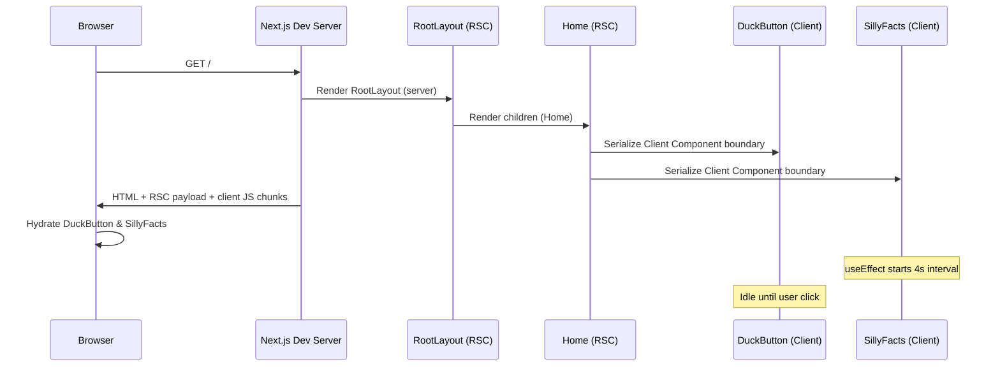

# Source Files Analysis Report

**Repository:** `starter-repo` (Silly Starter™)  
**Analysis date:** June 12, 2026  
**Scope:** Exhaustive review of all application source files under `/workspace`  
**Stack:** Next.js 16.2.9 · React 19.2.4 · TypeScript 5 · Tailwind CSS 4

---

## Table of Contents

1. [Executive Summary](#executive-summary)
2. [Complete File Inventory](#complete-file-inventory)
3. [Project Architecture Overview](#project-architecture-overview)
4. [Request and Render Flow](#request-and-render-flow)
5. [Component Hierarchy](#component-hierarchy)
6. [Dependency Graph](#dependency-graph)
7. [Cross-Cutting Patterns and Conventions](#cross-cutting-patterns-and-conventions)
8. [Per-File Analysis](#per-file-analysis)
   - [Configuration Layer](#configuration-layer)
   - [Application Shell (`src/app/`)](#application-shell-srcapp)
   - [Shared Components (`src/components/`)](#shared-components-srccomponents)
9. [Static Assets (`public/`)](#static-assets-public)
10. [Build, Dev, and Tooling Pipeline](#build-dev-and-tooling-pipeline)
11. [Security, Accessibility, and Performance Notes](#security-accessibility-and-performance-notes)
12. [Extension Points and Gaps](#extension-points-and-gaps)
13. [Appendix: Line Count Summary](#appendix-line-count-summary)

---

## Executive Summary

**Silly Starter™** is a minimal, whimsical Next.js starter application built on the **App Router** paradigm introduced in Next.js 13 and refined through Next.js 16. The codebase contains **five TypeScript/TSX source files**, **one global CSS file**, and **five configuration/tooling files** that together implement a single-page landing experience with two interactive client components: a duck button that displays random quips, and a rotating "silly facts" ticker.

There is **no backend logic**, **no API routes**, **no database**, **no middleware**, **no data fetching**, and **no routing beyond the root `/` path**. The application is intentionally thin: it demonstrates a modern React/Next.js stack (React 19, TypeScript strict mode, Tailwind CSS v4, Google Fonts via `next/font`) while prioritizing humor and visual polish over functional complexity.

The architecture follows the canonical Next.js App Router layout:

```
next.config.ts / tsconfig.json / postcss.config.mjs
        │
        ▼
src/app/layout.tsx  ──►  src/app/globals.css
        │
        ▼
src/app/page.tsx  ──►  src/components/DuckButton.tsx
                   └──►  src/components/SillyFacts.tsx
```

Server Components are the default; interactivity is isolated to two explicitly marked `"use client"` components. Styling is almost entirely utility-first via Tailwind, with a small set of custom CSS animations defined in `globals.css`.

---

## Complete File Inventory

### Application Source (`src/`)

| Path | Type | Lines | Role |
|------|------|-------|------|
| `src/app/layout.tsx` | Server Component | 34 | Root HTML shell, fonts, metadata |
| `src/app/page.tsx` | Server Component | 56 | Home page UI composition |
| `src/app/globals.css` | CSS | 66 | Tailwind import, theme tokens, animations |
| `src/components/DuckButton.tsx` | Client Component | 42 | Interactive duck button |
| `src/components/SillyFacts.tsx` | Client Component | 40 | Auto-rotating fact carousel |

**Total application source:** 238 lines across 5 files.

### Root Configuration and Tooling

| Path | Type | Lines | Role |
|------|------|-------|------|
| `next.config.ts` | TypeScript | 8 | Next.js runtime configuration |
| `next-env.d.ts` | TypeScript declarations | 7 | Next.js type references (auto-generated) |
| `tsconfig.json` | JSON | 35 | TypeScript compiler options |
| `postcss.config.mjs` | ESM JavaScript | 8 | PostCSS / Tailwind pipeline |
| `eslint.config.mjs` | ESM JavaScript | 19 | ESLint flat config |
| `package.json` | JSON | 27 | Dependencies and npm scripts |

### Static Assets (`public/`)

| Path | Type | Referenced in code? |
|------|------|---------------------|
| `public/file.svg` | SVG | No |
| `public/globe.svg` | SVG | No |
| `public/next.svg` | SVG | No |
| `public/vercel.svg` | SVG | No |
| `public/window.svg` | SVG | No |

These SVG files are leftover boilerplate from the Next.js create template and are **not imported or referenced** by any current source file. The home page uses emoji characters instead of image assets.

### Documentation (non-source, contextual)

| Path | Role |
|------|------|
| `README.md` | Project overview and setup instructions |
| `AGENTS.md` / `CLAUDE.md` | Agent guidance noting Next.js 16 breaking changes |

---

## Project Architecture Overview

### Architectural Style

The project implements a **monolithic single-route SPA-like experience** rendered through Next.js's hybrid rendering model. Despite having only one route, the App Router conventions are fully respected:

- **File-system routing:** `src/app/page.tsx` maps to `/`.
- **Root layout:** `src/app/layout.tsx` wraps all pages (currently only one).
- **Server-first rendering:** `layout.tsx` and `page.tsx` are Server Components by default.
- **Client islands:** Interactive UI is pushed into `DuckButton` and `SillyFacts` via the `"use client"` directive.

### Layer Model

```
┌─────────────────────────────────────────────────────────┐
│  Tooling Layer                                          │
│  tsconfig · eslint · postcss · next.config              │
├─────────────────────────────────────────────────────────┤
│  Presentation Layer (Server)                            │
│  layout.tsx · page.tsx                                  │
├─────────────────────────────────────────────────────────┤
│  Presentation Layer (Client)                            │
│  DuckButton.tsx · SillyFacts.tsx                        │
├─────────────────────────────────────────────────────────┤
│  Styling Layer                                          │
│  globals.css · Tailwind utilities · next/font           │
├─────────────────────────────────────────────────────────┤
│  Framework Runtime                                      │
│  Next.js 16 · React 19 · React DOM                      │
└─────────────────────────────────────────────────────────┘
```

### Key Architectural Decisions

1. **No `src/lib/`, `src/hooks/`, or `src/utils/` directories** — all logic lives inline within components.
2. **Path alias `@/*` → `./src/*`** — enables clean imports like `@/components/DuckButton`.
3. **Tailwind CSS v4** — uses the new `@import "tailwindcss"` and `@theme inline` syntax rather than a separate `tailwind.config.js`.
4. **Google Fonts via `next/font`** — Geist Sans and Geist Mono are loaded at build time with CSS variable injection, avoiding layout shift and external font requests at runtime.
5. **Dark mode via `prefers-color-scheme`** — no theme toggle component; system preference drives colors through CSS custom properties and Tailwind `dark:` variants.

---

## Request and Render Flow

### Development Request Flow (`npm run dev`)

When a browser requests `http://localhost:3000/`:



### Step-by-Step Render Pipeline

1. **Route resolution:** Next.js matches `/` to `src/app/page.tsx`.
2. **Layout wrapping:** `src/app/layout.tsx` wraps the page output in `<html>` and `<body>`.
3. **Server Component rendering:**
   - `RootLayout` executes on the server. It applies font CSS variables to `<html>`, imports global styles, and renders `{children}` inside `<body>`.
   - `Home` executes on the server. It renders static JSX including decorative emoji, headings, feature cards, and footer. It embeds `<DuckButton />` and `<SillyFacts />` as client component placeholders.
4. **Client boundary serialization:** React serializes props (empty in both cases) and component references for client bundles.
5. **HTML delivery:** The server sends HTML with pre-rendered static content. Client components appear as placeholders with their initial server-rendered output where applicable.
6. **Hydration:** React 19 hydrates `DuckButton` and `SillyFacts` on the client.
7. **Client-only effects:** `SillyFacts` starts its `setInterval` loop after mount. `DuckButton` waits for user interaction.

### Production Build Flow (`npm run build`)

1. **Compilation:** TypeScript is checked via Next.js's integrated type checking (using `tsconfig.json` settings).
2. **Static generation:** The home page is statically generated at build time (no dynamic functions like `cookies()`, `headers()`, or `fetch` with revalidation).
3. **Font optimization:** `next/font/google` downloads and self-hosts Geist font files at build time.
4. **CSS processing:** PostCSS runs `@tailwindcss/postcss`, scanning source files for utility classes and emitting optimized CSS.
5. **Code splitting:** Client components receive separate JavaScript chunks loaded on demand.
6. **Output:** Static HTML and assets are emitted to `.next/` (and potentially exported depending on config — default is Node.js server mode).

### What Does NOT Happen

- No middleware interception (`middleware.ts` absent).
- No API route handlers (`src/app/api/` absent).
- No server actions (`"use server"` absent).
- No streaming Suspense boundaries.
- No parallel or intercepting routes.
- No internationalization (`i18n` config absent).
- No authentication or session management.

---

## Component Hierarchy

### DOM / React Tree

```
RootLayout (Server)
└── html [lang=en, font variables, antialiased]
    └── body [min-h-full, flex, font-sans]
        └── Home / page.tsx (Server)
            └── div [gradient background container]
                ├── div [decorative floating emojis - pointer-events-none]
                │   ├── 🍞 (animate-float)
                │   ├── ✨ (animate-float-delayed)
                │   ├── 🌊 (animate-float)
                │   └── 🦆 (animate-float-delayed)
                └── main [centered content column]
                    ├── div [hero text block]
                    │   ├── p "Officially Unofficial"
                    │   ├── h1 "Silly Starter™"
                    │   └── p [tagline]
                    ├── DuckButton (Client)
                    │   └── div
                    │       ├── button [🦆 emoji]
                    │       └── p [quack message]
                    ├── SillyFacts (Client)
                    │   └── p [quoted fact]
                    ├── div [3-column feature grid]
                    │   └── div × 3 [feature cards]
                    └── footer
                        └── code "npm run dev"
```

### Server vs. Client Classification

| Component | File | Server/Client | Stateful? | Side Effects? |
|-----------|------|---------------|-----------|---------------|
| `RootLayout` | `layout.tsx` | Server | No | No |
| `Home` | `page.tsx` | Server | No | No |
| `DuckButton` | `DuckButton.tsx` | Client | Yes (`useState`) | `setTimeout` on click |
| `SillyFacts` | `SillyFacts.tsx` | Client | Yes (`useState`) | `setInterval` + `setTimeout` |

---

## Dependency Graph

### Module Import Graph

```
next.config.ts
  └── next (type: NextConfig)

next-env.d.ts
  ├── next (types)
  ├── next/image-types/global (types)
  └── ./.next/types/routes.d.ts (generated)

eslint.config.mjs
  ├── eslint/config
  ├── eslint-config-next/core-web-vitals
  └── eslint-config-next/typescript

postcss.config.mjs
  └── @tailwindcss/postcss (plugin)

src/app/layout.tsx
  ├── next (type: Metadata)
  ├── next/font/google (Geist, Geist_Mono)
  └── ./globals.css

src/app/page.tsx
  ├── @/components/DuckButton
  └── @/components/SillyFacts

src/components/DuckButton.tsx
  └── react (useState)

src/components/SillyFacts.tsx
  └── react (useEffect, useState)

src/app/globals.css
  └── tailwindcss (via @import)
```

### npm Dependency Graph (Runtime)

```
starter-repo
├── next@16.2.9
│   ├── react (peer)
│   └── react-dom (peer)
├── react@19.2.4
└── react-dom@19.2.4
    └── react
```

### npm Dependency Graph (Dev)

```
starter-repo (dev)
├── @tailwindcss/postcss ^4
├── tailwindcss ^4
├── typescript ^5
├── eslint ^9
├── eslint-config-next 16.2.9
├── @types/node ^20
├── @types/react ^19
└── @types/react-dom ^19
```

### Internal Dependency Direction

```
Configuration files ──► Framework (Next.js)
                              │
                              ▼
                        layout.tsx ──► globals.css
                              │
                              ▼
                          page.tsx ──► DuckButton
                                   └──► SillyFacts
```

**Observation:** Dependencies flow strictly downward. Components do not import from each other. There are no circular dependencies. Shared constants (`QUACKS`, `FACTS`) are module-scoped, not exported.

---

## Cross-Cutting Patterns and Conventions

### TypeScript

- **`strict: true`** in `tsconfig.json` — all strict checks enabled.
- **`Readonly<{ children: React.ReactNode }>`** in layout — props are typed as immutable.
- **Path alias `@/*`** — used in `page.tsx` for component imports.
- **No explicit return type annotations** on components — inferred JSX return types.

### React / Next.js

- **Default export** for pages and layout (`export default function`).
- **Named export** for reusable components (`export function DuckButton`).
- **`"use client"` directive** as the first line of client components.
- **No `React` namespace import** — relies on automatic JSX runtime (`"jsx": "react-jsx"`).

### Styling

- **Tailwind utility classes** dominate JSX `className` attributes.
- **Amber/orange/yellow palette** — consistent warm theme with dark mode variants.
- **Custom CSS classes** in `globals.css` for animations (`.animate-float`, `.wobble`, `.duck-btn`).
- **CSS custom properties** bridge fonts and colors: `--font-geist-sans`, `--background`, `--foreground`.

### Accessibility

- `lang="en"` on `<html>`.
- `aria-label="Quack button"` on the duck button.
- Semantic HTML: `<main>`, `<footer>`, `<h1>`, `<button type="button">`.
- Decorative emoji layer uses `pointer-events-none` to avoid blocking interaction.

### Humor / Copy Pattern

The codebase uses self-deprecating, meta commentary as a deliberate design choice — fact strings reference the stack itself (`"npm install took longer than building this page."`).

---

## Per-File Analysis

---

### Configuration Layer

---

#### `package.json`

**Purpose:** npm manifest defining project metadata, scripts, and dependencies.

**Scripts:**

| Script | Command | Description |
|--------|---------|-------------|
| `dev` | `next dev` | Starts development server with HMR |
| `build` | `next build` | Creates production build |
| `start` | `next start` | Serves production build |
| `lint` | `eslint` | Runs ESLint across project |

**Runtime dependencies:**

- `next@16.2.9` — Framework (App Router, RSC, bundler).
- `react@19.2.4` — UI library with React Compiler-ready features.
- `react-dom@19.2.4` — DOM renderer.

**Dev dependencies:**

- `@tailwindcss/postcss` + `tailwindcss` v4 — CSS framework and PostCSS integration.
- `typescript` — Static typing.
- `eslint` + `eslint-config-next` — Linting aligned with Next.js 16.
- `@types/*` — Type definitions for Node, React, React DOM.

**Notable absences:** No testing libraries (Jest, Vitest, Playwright), no state management (Zustand, Redux), no UI component libraries (shadcn, Radix).

---

#### `tsconfig.json`

**Purpose:** TypeScript compiler configuration for the entire project.

**Line-by-line analysis:**

| Lines | Content | Explanation |
|-------|---------|-------------|
| 1 | `{` | Root config object |
| 2–24 | `"compilerOptions"` | Compiler behavior settings |
| 3 | `"target": "ES2017"` | Emit modern JS compatible with Next.js browserslist |
| 4 | `"lib": ["dom", "dom.iterable", "esnext"]` | Include DOM and latest ECMAScript type definitions |
| 5 | `"allowJs": true` | Permit JavaScript files alongside TypeScript |
| 6 | `"skipLibCheck": true` | Skip type checking of declaration files (faster builds) |
| 7 | `"strict": true` | Enable all strict type-checking options |
| 8 | `"noEmit": true` | TypeScript only checks; Next.js handles emission |
| 9 | `"esModuleInterop": true` | CommonJS/ESM interop for imports |
| 10 | `"module": "esnext"` | Use ES modules |
| 11 | `"moduleResolution": "bundler"` | Modern resolution matching Next.js bundler |
| 12 | `"resolveJsonModule": true` | Allow importing JSON files |
| 13 | `"isolatedModules": true` | Each file must be independently transpilable (required for SWC/Babel) |
| 14 | `"jsx": "react-jsx"` | Use automatic JSX runtime (no `import React`) |
| 15 | `"incremental": true` | Enable incremental compilation cache |
| 16–19 | `"plugins": [{ "name": "next" }]` | Next.js TypeScript plugin for typed routes, etc. |
| 21–23 | `"paths": { "@/*": ["./src/*"] }` | Path alias for `src/` directory |
| 25–31 | `"include"` | Files to type-check: all TS/TSX, Next env, generated `.next/types` |
| 32–33 | `"exclude": ["node_modules"]` | Exclude dependencies |

**Exports:** N/A (JSON config file).

---

#### `next.config.ts`

**Purpose:** Next.js framework configuration entry point.

**Imports:**
- `import type { NextConfig } from "next"` — Type-only import for config typing.

**Exports:**
- `export default nextConfig` — Default export of empty config object.

**Line-by-line:**

| Line | Code | Explanation |
|------|------|-------------|
| 1 | `import type { NextConfig } from "next";` | Import configuration type |
| 3 | `const nextConfig: NextConfig = {` | Typed config constant |
| 4 | `/* config options here */` | Placeholder comment — no options configured |
| 5 | `};` | Close config object |
| 7 | `export default nextConfig;` | Export for Next.js to consume |

**Implications:** Default Next.js behavior applies for all settings: image optimization, bundling, App Router, etc. No custom redirects, rewrites, headers, `experimental` flags, or `output: 'export'`.

---

#### `next-env.d.ts`

**Purpose:** Auto-generated TypeScript reference file for Next.js ambient types. **Should not be edited manually.**

**Line-by-line:**

| Line | Code | Explanation |
|------|------|-------------|
| 1 | `/// <reference types="next" />` | Triple-slash directive pulling in Next.js core types |
| 2 | `/// <reference types="next/image-types/global" />` | Types for static image imports (`.png`, `.jpg`, etc.) |
| 3 | `import "./.next/types/routes.d.ts";` | Import generated typed route definitions |
| 5–6 | Comment | Documentation link to Next.js TypeScript docs |

**Exports:** None. This file only augments the TypeScript compilation context.

**Note:** The `routes.d.ts` import requires a prior `next dev` or `next build` to generate `.next/types/`.

---

#### `postcss.config.mjs`

**Purpose:** PostCSS configuration for CSS processing pipeline.

**Exports:** Default export of config object.

**Line-by-line:**

| Line | Code | Explanation |
|------|------|-------------|
| 1–5 | `const config = { plugins: { "@tailwindcss/postcss": {} } }` | Registers Tailwind CSS v4 PostCSS plugin |
| 7 | `export default config;` | ESM default export |

**Flow:** When Next.js processes CSS files, PostCSS runs `@tailwindcss/postcss`, which interprets `@import "tailwindcss"` in `globals.css` and generates utility CSS based on class usage in source files.

---

#### `eslint.config.mjs`

**Purpose:** ESLint flat configuration (ESLint 9+ format) for code quality.

**Imports:**
- `defineConfig`, `globalIgnores` from `eslint/config`
- `eslint-config-next/core-web-vitals` — Performance and accessibility rules
- `eslint-config-next/typescript` — TypeScript-specific rules

**Exports:** Default export of config array.

**Line-by-line:**

| Lines | Code | Explanation |
|-------|------|-------------|
| 1–3 | Imports | Load ESLint utilities and Next.js preset configs |
| 5–16 | `defineConfig([...])` | Compose configuration array |
| 6–7 | Spread `nextVitals` and `nextTs` | Apply Next.js recommended rulesets |
| 9–15 | `globalIgnores([...])` | Ignore build output and auto-generated files |
| 18 | `export default eslintConfig` | Export composed config |

**Ignored paths:** `.next/**`, `out/**`, `build/**`, `next-env.d.ts`.

---

### Application Shell (`src/app/`)

---

#### `src/app/layout.tsx`

**Purpose:** Root layout component — wraps every page in the application with HTML document structure, fonts, global styles, and SEO metadata.

**Type:** Server Component (no `"use client"` directive).

**Imports:**

| Import | Source | Usage |
|--------|--------|-------|
| `Metadata` (type) | `next` | Type for exported metadata object |
| `Geist`, `Geist_Mono` | `next/font/google` | Google Font loaders |
| `./globals.css` | Local | Global stylesheet side-effect import |

**Exports:**

| Export | Type | Description |
|--------|------|-------------|
| `metadata` | `Metadata` constant | Page title and description for SEO |
| `RootLayout` (default) | React Server Component | Root HTML wrapper |

**Module-level constants:**

```typescript
const geistSans = Geist({ variable: "--font-geist-sans", subsets: ["latin"] });
const geistMono = Geist_Mono({ variable: "--font-geist-mono", subsets: ["latin"] });
```

These invoke `next/font/google` loaders at module initialization. Each returns an object with a `.variable` property containing a unique CSS class name that sets the corresponding `--font-*` custom property on the element.

**Metadata object (lines 15–18):**

```typescript
export const metadata: Metadata = {
  title: "Silly Starter™ — A Very Serious Next.js App",
  description: "A whimsical Next.js starter that quacks under pressure.",
};
```

Next.js reads this static export at build time to populate `<title>` and `<meta name="description">` tags in the document head.

**RootLayout function (lines 20–33):**

| Lines | Code | Explanation |
|-------|------|-------------|
| 20–24 | Function signature | Accepts `children` typed as `Readonly<{ children: React.ReactNode }>` |
| 26–28 | `<html lang="en" className={...}>` | Document root with English language, font CSS variables applied, full height, antialiased text |
| 28 | `` `${geistSans.variable} ${geistMono.variable}` `` | Template literal combining both font variable class names |
| 30 | `<body className="min-h-full flex flex-col font-sans">` | Body fills viewport, column flex layout, uses sans font family (mapped to Geist Sans via `@theme`) |
| 30 | `{children}` | Renders nested page content |
| 31–32 | Closing tags | Standard HTML closure |

**Functions:** One — `RootLayout` (default export).

**Components:** One — `RootLayout`.

**Hooks:** None (Server Component).

---

#### `src/app/page.tsx`

**Purpose:** Home page component — the sole route (`/`) of the application. Composes the full landing page UI from static content and two client components.

**Type:** Server Component.

**Imports:**

| Import | Source | Usage |
|--------|--------|-------|
| `DuckButton` | `@/components/DuckButton` | Interactive duck widget |
| `SillyFacts` | `@/components/SillyFacts` | Rotating facts display |

**Exports:**

| Export | Type | Description |
|--------|------|-------------|
| `Home` (default) | React Server Component | Home page |

**Home function — complete line-by-line analysis:**

| Line(s) | Code | Explanation |
|---------|------|-------------|
| 4 | `export default function Home()` | Default-exported page component, no props (static page) |
| 6 | Outer `div` with gradient classes | Full-viewport container: centered flex column, amber/orange/yellow gradient background, responsive padding, dark mode gradient variants, overflow hidden |
| 7 | `pointer-events-none absolute inset-0 opacity-30` | Decorative layer covering full container, non-interactive, semi-transparent |
| 8 | `🍞` emoji div | Bread emoji at ~10% left, 15% top, large text, `animate-float` |
| 9 | `✨` emoji div | Sparkle at ~85% right, 25% top, medium text, `animate-float-delayed` (2s delay) |
| 10 | `🌊` emoji div | Wave at ~20% left, 80% bottom, small text, `animate-float` |
| 11 | `🦆` emoji div | Duck at ~90% right, 70% bottom, extra large, `animate-float-delayed` |
| 14 | `<main>` | Semantic main content landmark, z-index 10 above decorations, max-width 2xl, centered column, gap-10 |
| 15–25 | Hero section | Text block with eyebrow label, main heading, tagline |
| 16 | `"Officially Unofficial"` | Monospace uppercase eyebrow text in amber-600 |
| 19–21 | `<h1>Silly Starter™</h1>` | Primary heading, 5xl/6xl responsive, font-black |
| 22–24 | Tagline paragraph | Subtitle in muted amber tone |
| 27 | `<DuckButton />` | Client component insertion point |
| 29 | `<SillyFacts />` | Client component insertion point |
| 31–46 | Feature grid | Three-column responsive grid (stacks on mobile) |
| 32–35 | Inline array of feature objects | `{ emoji, label, desc }` tuples defined inline (not extracted) |
| 36–45 | `.map()` render | Maps array to card divs keyed by `item.label` |
| 37–44 | Feature card | Dashed border, rounded, semi-transparent background, backdrop blur |
| 48–51 | Footer | Monospace small text with `npm run dev` in `<code>` |
| 54 | Closing tags | End of component tree |

**Inline data structure (lines 32–35):**

```typescript
[
  { emoji: "⚡", label: "Fast-ish", desc: "React 19. Probably fine." },
  { emoji: "🎨", label: "Styled", desc: "Tailwind included. Duck approved." },
  { emoji: "🤷", label: "Typed", desc: "TypeScript for your mistakes." },
]
```

This array is recreated on every render but, as a Server Component with no dynamic data, this has no runtime cost concern — it is computed once at build/request time on the server.

**Functions:** One — `Home`.

**Components:** One — `Home` (composes child components but does not define nested function components).

**Hooks:** None.

---

#### `src/app/globals.css`

**Purpose:** Global stylesheet — Tailwind entry point, design tokens, dark mode overrides, and custom keyframe animations.

**Imports:**
- `@import "tailwindcss";` — Tailwind CSS v4 single-import activation.

**Exports:** N/A (CSS cascade, no JS exports).

**Line-by-line analysis:**

| Line(s) | Code | Explanation |
|---------|------|-------------|
| 1 | `@import "tailwindcss";` | Activates Tailwind; replaces legacy `@tailwind base/components/utilities` directives |
| 3–6 | `:root { --background; --foreground }` | Light mode CSS custom properties: warm cream background (`#fffbeb`), dark brown text (`#451a03`) |
| 8–13 | `@theme inline { ... }` | Tailwind v4 theme extension mapping CSS vars to Tailwind tokens |
| 9 | `--color-background: var(--background)` | Enables `bg-background` utility (if used) |
| 10 | `--color-foreground: var(--foreground)` | Enables `text-foreground` utility (if used) |
| 11 | `--font-sans: var(--font-geist-sans)` | Maps Tailwind `font-sans` to Geist Sans variable from layout |
| 12 | `--font-mono: var(--font-geist-mono)` | Maps Tailwind `font-mono` to Geist Mono variable |
| 15–20 | `@media (prefers-color-scheme: dark)` | System dark mode detection |
| 16–19 | Dark `:root` overrides | Dark background (`#1c1108`), light foreground (`#fef3c7`) |
| 22–25 | `body { background; color }` | Apply semantic colors to body element |
| 27–35 | `@keyframes float` | Vertical bobbing animation: 0/100% at rest, 50% rises 12px and rotates 5deg |
| 37–48 | `@keyframes wobble` | Rotation wobble: oscillates ±12deg with 1.1 scale at peaks |
| 50–52 | `.animate-float` | Applies float animation: 4s, ease-in-out, infinite |
| 54–56 | `.animate-float-delayed` | Same as float but with 2s delay for staggered effect |
| 58–60 | `.wobble` | Applies wobble animation: 0.5s, triggered programmatically on duck click |
| 62–65 | `.duck-btn` | Pointer cursor and amber drop shadow for duck button |

**Design token flow:**

```
layout.tsx (next/font)
    └── sets --font-geist-sans, --font-geist-mono on <html>
            │
globals.css (@theme inline)
    └── maps --font-sans, --font-mono to those variables
            │
Tailwind utilities (font-sans, font-mono)
    └── used in JSX classNames
```

---

### Shared Components (`src/components/`)

---

#### `src/components/DuckButton.tsx`

**Purpose:** Interactive duck emoji button that displays a random humorous message on each click, with a wobble animation feedback.

**Type:** Client Component (`"use client"` on line 1).

**Imports:**

| Import | Source | Usage |
|--------|--------|-------|
| `useState` | `react` | Local state for quack text and wobble flag |

**Exports:**

| Export | Type | Description |
|--------|------|-------------|
| `DuckButton` | Named function component | Interactive duck button |

**Module-level constants:**

```typescript
const QUACKS = [
  "Quack!",
  "Honk??",
  "Bread acquired.",
  "Professional waddler.",
  "404: dignity not found.",
  "This button does nothing. Like my degree.",
  "You're doing great, probably.",
  "Have you tried turning the duck off and on again?",
];
```

Eight strings, not exported. Selected uniformly at random on click via `Math.floor(Math.random() * QUACKS.length)`.

**State variables:**

| State | Type | Initial | Purpose |
|-------|------|---------|---------|
| `quack` | `string` | `"Press for wisdom"` | Displayed message below button |
| `wobble` | `boolean` | `false` | Toggles `.wobble` CSS class for animation |

**Functions:**

**`handleClick()` (lines 20–24):**

| Line | Code | Explanation |
|------|------|-------------|
| 21 | `setQuack(QUACKS[Math.floor(Math.random() * QUACKS.length)])` | Pick random quip from array |
| 22 | `setWobble(true)` | Enable wobble animation class |
| 23 | `setTimeout(() => setWobble(false), 500)` | Remove wobble after 500ms (matches CSS animation duration) |

**Note:** The `setTimeout` is not cleaned up on unmount — in a component this simple with no rapid mount/unmount, this is acceptable but would be a minor leak if the component unmounted within 500ms of a click.

**Render output (lines 26–40):**

| Line(s) | Code | Explanation |
|---------|------|-------------|
| 27 | Container `div` | Flex column, centered, gap-4 |
| 28–35 | `<button>` | Duck emoji button |
| 29 | `type="button"` | Explicit button type (prevents form submission if ever nested) |
| 30 | `onClick={handleClick}` | Click handler binding |
| 31 | Dynamic className | Combines: `duck-btn`, `text-6xl`, hover/active scale transforms, conditional `wobble` |
| 32 | `aria-label="Quack button"` | Screen reader accessible label |
| 34 | `🦆` | Button content (emoji character) |
| 36–38 | Message paragraph | Monospace small text displaying current `quack` state |

**Component hierarchy:**

```
DuckButton
└── div.flex.flex-col
    ├── button.duck-btn (🦆)
    └── p (quack message)
```

---

#### `src/components/SillyFacts.tsx`

**Purpose:** Displays rotating humorous "facts" about the app/stack, cycling every 4 seconds with a fade transition.

**Type:** Client Component.

**Imports:**

| Import | Source | Usage |
|--------|--------|-------|
| `useEffect` | `react` | Interval setup and cleanup |
| `useState` | `react` | Fact index and visibility for fade |

**Exports:**

| Export | Type | Description |
|--------|------|-------------|
| `SillyFacts` | Named function component | Auto-rotating fact display |

**Module-level constants:**

```typescript
const FACTS = [
  "This app has zero business logic and infinite vibes.",
  "Next.js can render on the server. This duck cannot.",
  "TypeScript knows your types. The duck knows your secrets.",
  "Tailwind has 4,291 utility classes. You will use twelve.",
  "npm install took longer than building this page.",
  "Somewhere, a senior engineer is crying over this architecture.",
  "Hot reload works. Your motivation might not.",
  "This starter repo is 90% whimsy, 10% dependencies.",
];
```

Eight facts, cycled modulo `FACTS.length`.

**State variables:**

| State | Type | Initial | Purpose |
|-------|------|---------|---------|
| `index` | `number` | `0` | Current fact index |
| `visible` | `boolean` | `true` | Controls opacity for fade transition |

**Effects:**

**`useEffect` (lines 20–30):**

| Line | Code | Explanation |
|------|------|-------------|
| 20 | `useEffect(() => { ... }, [])` | Run once on mount, empty dependency array |
| 21 | `setInterval(..., 4000)` | Every 4 seconds, trigger transition |
| 22 | `setVisible(false)` | Start fade-out (opacity → 0) |
| 23–26 | Nested `setTimeout(..., 300)` | After 300ms (matching CSS transition duration): |
| 24 | `setIndex((i) => (i + 1) % FACTS.length)` | Advance to next fact with wraparound |
| 25 | `setVisible(true)` | Fade back in |
| 29 | `return () => clearInterval(interval)` | Cleanup interval on unmount |

**Timing diagram:**

```
0s ──────── 4s ──────── 8s ──────── 12s ────
   [fact 0]    fade→fact1   fade→fact2   ...
               300ms trans   300ms trans
```

**Render output (lines 32–38):**

| Line(s) | Code | Explanation |
|---------|------|-------------|
| 33–37 | `<p>` with dynamic classes | Italic quoted text, max-width lg, centered |
| 34 | `transition-opacity duration-300` | CSS transition for fade effect |
| 34 | `${visible ? "opacity-100" : "opacity-0"}` | Conditional opacity |
| 36 | `&ldquo;{FACTS[index]}&rdquo;` | HTML entity curly quotes around current fact |

**Note:** The nested `setTimeout` inside `setInterval` is not cleared on unmount — if the component unmounts during the 300ms fade window, a state update on an unmounted component could occur. In practice, this page is static and the component is unlikely to unmount.

---

## Static Assets (`public/`)

The `public/` directory contains five SVG files from the default Next.js template:

| File | Approximate content | Used? |
|------|---------------------|-------|
| `file.svg` | Document/file icon | No |
| `globe.svg` | Globe/world icon | No |
| `next.svg` | "NEXT" wordmark | No |
| `vercel.svg` | Vercel triangle logo | No |
| `window.svg` | Window/browser icon | No |

In Next.js, files in `public/` are served at the root URL (e.g., `/next.svg`). None are currently referenced. They could be removed without affecting the application, or used via `<Image src="/next.svg" />` in future pages.

---

## Build, Dev, and Tooling Pipeline

### Development (`npm run dev`)

1. Next.js 16 dev server starts (default port 3000).
2. Turbopack or Webpack (depending on Next.js 16 defaults) watches file changes.
3. On file save, Fast Refresh updates components without full page reload.
4. TypeScript errors surface in terminal and browser overlay.
5. PostCSS processes CSS on demand.

### Production Build (`npm run build`)

1. **Lint phase:** Optional (not in build script by default).
2. **Compilation:** SWC transpiles TypeScript/JSX.
3. **Static page generation:** `/` is pre-rendered as static HTML.
4. **Client bundle creation:** `DuckButton` and `SillyFacts` code-split into client chunks.
5. **Font optimization:** Geist fonts downloaded and self-hosted.
6. **CSS extraction:** Tailwind purges unused utilities, outputs minimal CSS.

### Lint (`npm run lint`)

ESLint 9 flat config runs with Next.js core-web-vitals and TypeScript rulesets. Checks all non-ignored source files.

### File Processing Chain for CSS

```
globals.css
    │ @import "tailwindcss"
    ▼
PostCSS (@tailwindcss/postcss)
    │ scans *.tsx for class names
    ▼
Optimized CSS bundle
    │ imported by layout.tsx
    ▼
Injected into HTML <head>
```

---

## Security, Accessibility, and Performance Notes

### Security

- **No user input** — no XSS vectors from form data.
- **No API routes** — no server-side injection surface in app code.
- **No environment variables** — no secrets in codebase.
- **No external runtime requests** — fonts loaded at build time via `next/font`.

### Accessibility

| Feature | Status | Location |
|---------|--------|----------|
| Document language | ✅ `lang="en"` | `layout.tsx:27` |
| Semantic landmarks | ✅ `<main>`, `<footer>` | `page.tsx` |
| Button labeling | ✅ `aria-label` | `DuckButton.tsx:32` |
| Decorative content | ✅ `pointer-events-none` | `page.tsx:7` |
| Color contrast | ⚠️ Muted text may be borderline | Various amber opacity classes |
| Keyboard navigation | ✅ Native `<button>` | `DuckButton.tsx` |
| Focus indicators | ⚠️ Not explicitly styled | Relies on browser defaults |
| Reduced motion | ❌ Animations always run | No `prefers-reduced-motion` query |

### Performance

- **Static page** — instant TTFB for pre-rendered HTML.
- **Minimal JS** — only two small client components hydrate.
- **No images** — emoji are text, no image optimization needed.
- **Self-hosted fonts** — no render-blocking Google Fonts CDN requests.
- **CSS purging** — Tailwind emits only used utilities.

---

## Extension Points and Gaps

### Natural Extension Points

| Area | How to extend |
|------|---------------|
| New routes | Add `src/app/about/page.tsx`, etc. |
| API backend | Add `src/app/api/*/route.ts` handlers |
| Shared logic | Create `src/lib/` for utilities |
| Custom hooks | Create `src/hooks/` for reusable stateful logic |
| Middleware | Add `src/middleware.ts` for request interception |
| Metadata | Extend `metadata` export or add `generateMetadata` |
| Theming | Add theme toggle component + `next-themes` or similar |
| Testing | Add Vitest/Jest + React Testing Library |

### Current Gaps

- No error boundaries (`error.tsx`) or loading states (`loading.tsx`).
- No `not-found.tsx` custom 404 page.
- No `robots.txt` or `sitemap.xml`.
- No Open Graph or Twitter card metadata.
- No analytics or monitoring.
- No CI/CD configuration.
- No Docker or deployment config.
- Dead SVG assets in `public/`.

---

## Appendix: Line Count Summary

| Category | Files | Total Lines |
|----------|-------|-------------|
| App Router (TSX) | 2 | 90 |
| Components (TSX) | 2 | 82 |
| Styles (CSS) | 1 | 66 |
| Config (TS/JS/JSON) | 6 | 97 |
| **Source total** | **11** | **335** |

*(Excludes README, agent docs, public assets, and git metadata.)*

---

## Conclusion

The **Silly Starter™** codebase is a deliberately minimal Next.js 16 application that showcases the App Router's Server/Client Component split, Tailwind CSS v4 integration, and React 19 patterns in under 350 lines of source code. Its architecture is linear and acyclic: configuration feeds the framework, the root layout provides document structure and design tokens, the home page composes static and interactive elements, and two client components encapsulate all browser-side state and effects.

The project contains no business logic, no data layer, and no routing complexity — making it an ideal blank canvas for experimentation with Next.js 16's evolving APIs while maintaining a cohesive, playful visual identity centered on amber tones, floating emoji decorations, and duck-themed interactivity.

---

*Report generated by exhaustive static analysis of all source files in `/workspace`.*
